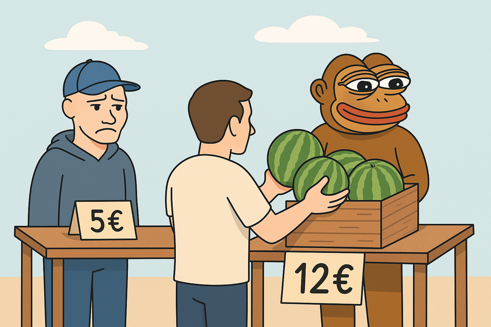

# Mechanik des Marktes

:::{.subtitle}
Preis verschiebt sich nur, wenn Angebot und Nachfrage nicht im Gleichgewicht sind
:::

Um die Mechanik des Marktes zu verstehen, stellen wir uns folgende Szene vor: Bro und Ponke stehen auf dem Marktplatz. Beide verkaufen Melonen. Ponke bietet seine Melonen für `8€`, Bro will `10€`. Ein Kunde kommt vorbei und kauft bei Ponke. Bro ärgert sich über das Geschäft und senkt daraufhin trotzig seinen Preis auf `5€`. Doch statt dass er nun mehr Kunden gewinnt, nutzt Ponke die Gelegenheit: *Er kauft alle Melonen von Bro auf, stapelt sie auf seinem eigenen Stand und setzt den Preis auf `12€`.* Jetzt gibt es keine Konkurrenz mehr und die Käufer, die Melonen wollen, müssen bei Ponke kaufen, zu seinem Preis. Bro bleibt frustriert zurück: Er hat seine Ware *verramscht*! ^[Diese Geschichte ist eine Adaption eines Memes, das ursprünglich auf TikTok kursierte. Die Figuren Ponke und Bro wurden in diesem Buch kontextualisiert, um Marktmechanik zu veranschaulichen.]

**Genau dieses Prinzip findest du in allen Märkten wieder.** Preisbildung ist nichts anderes als ein ständiges Ringen von *Angebot* und *Nachfrage*, von Wettbewerb und Kontrolle. Wer die Ware (oder im Finanzmarkt: die Liquidität) kontrolliert, bestimmt auch die Preise.

In diesem Kapitel schauen wir uns an, was *wirklich* hinter Preisbewegungen steckt. Wir beginnen mit dem *Wellenmodell*, dem Grundmuster jeder Marktbewegung. Es beschreibt den ständigen Wechsel von Impuls und Korrektur, von Balance und Imbalance, und zeigt: Preisbewegungen sind nicht zufällig, sondern folgen einem wiederkehrenden Rhythmus. Darauf aufbauend vertiefen wir die Funktionsweise von Orders, Liquidität und Volumen. Hier wird deutlich, wie Käufe und Verkäufe überhaupt zustande kommen, welche Rolle das Orderbuch spielt und warum Begriffe wie Liquidität und Volumen in der Praxis viel mehr bedeuten, als man auf den ersten Blick denkt. Keine Sorge: wir klären diese Begriffe im nächsten Abschnitt präzise. Anschließend richten wir den Blick auf das institutionelle Verhalten. Wir untersuchen, wie große Marktteilnehmer ihre Orders im Markt unterbringen, warum es dabei oft zu sogenannten „Stop-Runs“ kommt und weshalb gerade auf niedrigen Zeitebenen scheinbares Chaos entsteht, das auf den höheren Zeitebenen plötzlich Sinn ergibt. Am Ende fassen wir die Konsequenzen fürs Trading zusammen: **Wir Retail-Trader bewegen den Markt nicht.** Unsere Aufgabe ist es, die Absicht hinter den Bewegungen zu deuten und daraus das wahrscheinlichste Szenario abzuleiten. Genau hier liegt unsere Edge:

> Verstehen statt kontrollieren – das ist die eigentliche Aufgabe.