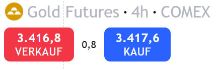

## Orderflow 101

Orderflow klingt nach einem großen Geheimnis, doch im Kern ist es nichts anderes als der *Fluss von Kauf- und Verkaufsorders*, die im Markt aufeinandertreffen. Immer wenn ein Käufer und ein Verkäufer zusammenfinden, entsteht ein *Trade*.

- Eine *Order* ist die Absicht, etwas zu kaufen oder zu verkaufen.
- Ein *Trade* ist die tatsächliche Ausführung – wenn sich zwei Orders „matchen“.

Doch nicht alle Orders sind gleich. Man unterscheidet zwischen zwei Rollen:

- Aktive Orders (*Market Orders*) wollen sofort ausgeführt werden. Sie „springen in den Markt“ und nehmen, was gerade verfügbar ist. Damit *konsumieren sie Liquidität*.
- Passive Orders (*Limit Orders*) warten im Orderbuch, bis jemand gegen sie handelt. Damit *stellen sie Liquidität bereit*.

Ohne aktive Orders bewegt sich kein Preis. Ohne passive Orders gibt es nichts, woran die aktiven handeln könnten. Der Markt braucht also beide Seiten, um überhaupt zu funktionieren. Das führt zu einem wichtigen Punkt: *Liquidität* bezeichnet die Menge an passiven Orders im Markt – also wie leicht aktive Orders ausgeführt werden können, ohne den Preis stark zu verschieben. Je mehr Limit Orders im Buch stehen, desto „tiefer“ der Markt. Je weniger, desto anfälliger ist er für plötzliche Sprünge.

:::{.takeaway}
**Wusstest du schon?** Wenn jemand behauptet, „der Orderflow dreht ins Bullishe“, klingt das beeindruckend, ist aber unsauber. *Orderflow ändert sich nicht.* Was sich ändert, ist das Verhältnis von aktiven Käufern zu passiven Verkäufern – oder umgekehrt. Der Preis steigt, wenn Kauforders die vorhandene Liquidität auf der Angebotsseite auffressen. Er fällt, wenn Verkaufsorders die Liquidität auf der Nachfrageseite überrollen.
:::

### Das Orderbuch – Bid, Ask, Spread, Liquidität

Um Orderflow zu verstehen, müssen wir beim Fundament beginnen: dem *Orderbuch*. Es ist das zentrale Register aller offenen Kauf- und Verkaufsorders eines Marktes – sozusagen die Angebots- und Nachfrageliste in Echtzeit. Die einfachste Form des Orderbuchs sieht man in fast jedem Trading-Interface. Dort werden zwei Preise angezeigt:



Links in Rot sehen wir den *Bid-Preis* (hier 3.416,8 €). Das ist der höchste Preis, den Käufer aktuell zu zahlen bereit sind. Rechts in Blau steht der *Ask-Preis* (hier 3.417,6 €). Das ist der niedrigste Preis, zu dem Verkäufer gerade verkaufen wollen. Die Differenz dazwischen nennt man den *Spread* (hier 0,8 €). Der Spread ist wie die Reibung im Markt: Wer sofort kaufen will, muss den höheren Ask akzeptieren. Wer sofort verkaufen will, muss den niedrigeren Bid hinnehmen. Doch diese zwei Zahlen sind nur die Spitze des Eisbergs. Hinter Bid und Ask verbirgt sich ein ganzes Register an gestapelten Kauf- und Verkaufsorders: das vollständige Orderbuch.

{#fig:orderbook}

In [@fig:orderbook] siehst du ein typisches Orderbuch mit den entsprechenden Preisniveaus für Bids (grün) und Asks, (rot). Der aktuelle Marktpreis bewegt sich immer zwischen der besten Kauforder und der besten Verkaufsorder. Er ist also kein einzelner fixer Punkt, sondern ein Spannungsfeld zwischen Bid und Ask. Sobald eine Market Order hereinkommt, „springt“ sie auf die Gegenseite: ein Käufer nimmt den besten Ask, ein Verkäufer den besten Bid. Damit ändert sich der Preis.

Liquidität beschreibt in diesem Zusammenhang, wie viele Limit Orders im Buch stehen:

- Ein Markt mit viel Liquidität hat ein „tiefes Regal“ – große Orders können ausgeführt werden, ohne den Preis stark zu bewegen.
- Ein Markt mit wenig Liquidität ist dagegen anfällig – schon kleine Market Orders können dort Sprünge von mehreren Prozent auslösen.

Liquidität hängt dabei stark von der *Ordertiefe* ab. Unter Ordertiefe versteht man die Verteilung der Limit Orders auf den verschiedenen Preisniveaus. Je tiefer ein Orderbuch gefüllt ist – also je mehr Kauf- und Verkaufsorders auch mehrere Ticks^[*Tick*: kleinste mögliche Preisbewegung] entfernt liegen –, desto stabiler wirkt der Markt. Eine flache Ordertiefe bedeutet dagegen, dass hinter dem besten Bid/Ask kaum Volumen liegt: Der Preis kann schon durch kleine Market Orders leicht in die Tiefe „durchrutschen“ oder nach oben „springen“. Ordertiefe ist damit *ein Maß dafür, wie robust der Markt auf Druck reagiert* – nicht nur im ersten Tick, sondern auch mehrere Preisstufen weiter.

:::{.takeaway}
**Wusstest du schon?** Das Orderbuch, das du im Trading-Interface siehst, ist immer nur ein Ausschnitt. Bei Futures oder zentralisierten Märkten gibt es ein gemeinsames Orderbuch (z. B. an der CME). Bei Spot-Märkten oder in Krypto dagegen hat jeder Broker oder jede Börse sein eigenes Orderbuch – du siehst also nur die Orders, die über genau diesen Marktplatz laufen. Später gehen wir genauer darauf ein, warum das für das Verständnis von Liquidität so wichtig ist.
:::

### Der Matching-Prozess – wie ein Trade entsteht

Jetzt wissen wir: Das Orderbuch ist gefüllt mit Kauf- und Verkaufsorders, die aufeinander warten. Doch wie genau entsteht daraus eine Preisbewegung? 

Nehmen wir das Orderbuch aus Abbildung [@fig:orderbook]. Angenommen, ein Trader platziert eine Market Buy Order über 1500 SOL. Die Order sucht sich die Gegenseite – in diesem Fall die Verkaufsseite (Ask). Im Orderbuch liegen mehrere gestaffelte Verkaufsorders:

- 916 SOL zu 210.892
- 301 SOL zu 210.893
- 122 SOL zu 210.895
- und so weiter

Eine Market-Buy-Order räumt die Ask-Seite des Orderbuchs von unten nach oben auf: Sie nimmt zuerst den Best Ask und arbeitet sich so lange aufwärts durch die nächsthöheren Preisstufen, bis die gewünschte Stückzahl vollständig gefüllt ist. In unserem Beispiel werden aus 1500 SOL zunächst 916 SOL zum Preis 210.892 gefüllt; die verbleibenden 584 SOL schlagen am nächsten Ask-Level an. Es folgen 301 SOL zu 210.893, danach 122 SOL zu 210.895, und so weiter, bis die komplette Order ausgeführt ist. Der durchschnittliche Ausführungspreis dieser einen Market-Order (i. e. ihr *Order-VWAP*) ist das gewichtete Mittel aller Ausführungen:

```math
Order-VWAP = (916*210.892 + 
              301*210.893 + 
              122*210.895 + ...) / 1500
           = 210.893 
```

Der exakte Durchschnittspreis hängt dabei immer von allen tatsächlich gehandelten Teilmengen ab – je nachdem, wie tief die Market Order ins Orderbuch greift und ob während der Ausführung einzelne Preisniveaus bereits wieder aufgefüllt werden, kann der Wert leicht variieren. Was danach im Buch sichtbar ist:

- Die abgearbeiteten Verkaufsorders sind entfernt – sie wurden gehandelt.
- Der letzte Fill wurde bei 210.901 ausgeführt.
- Der Spread kann sich kurzfristig ausweiten, weil die besten Ask-Level entfernt wurden und der neue Best-Ask höher liegt (210.901-210.878=0.023), bis neue Limit-Sells die Ask-Seite wieder auffüllen.

In der Realität ist der Ablauf noch dynamischer: Ständig treffen neue Orders gleichzeitig auf den Markt. Dein Broker sortiert sie zeitlich und gleicht sie mit dem Orderbuch ab. Dieses verändert sich fortlaufend – Preislevel füllen sich neu, oder Orders werden kurz vor der Ausführung zurückgezogen. Deshalb kann es passieren, dass du deine Market Order bei einem Preis von 210.892 einreichst, aber tatsächlich erst bei 211.053 gefüllt wirst, weil andere Trader die günstigeren Asks bereits zuvor weggekauft haben. Dieses Phänomen nennt man *Slippage*.

Doch das Orderbuch bleibt nicht lange „ausgedünnt“. In liquiden Märkten springen sofort neue Verkäufer oder Market Maker in die Lücken und stellen frische Orders bereit. So verkleinert sich der Spread rasch wieder.

:::{.takeaway}
**Wusstest du schon?** *Market Maker* sind keine bösen Manipulatoren, die dich „jagen“. Im Gegenteil: Sie stellen den Großteil der Liquidität bereit. Ihre Aufgabe ist es, stets Kauf- und Verkaufsorders anzubieten, damit andere Marktteilnehmer handeln können. ihr Gewinn entsteht nicht dadurch, dass sie Trader gezielt ausstoppen, sondern aus dem Spread und aus Gebührenmodellen. Ohne Market Maker gäbe es keine engen Spreads – und damit auch keinen funktionierenden Handel.
:::

### A-Book vs. B-Book – und warum es wichtig ist

Das obige Beispiel beschreibt den idealen Mechanismus eines echten Orderbuchs – so, wie er an zentralisierten Börsen oder im Futures-Handel funktioniert. Dort werden Market Orders unmittelbar gegen die im Orderbuch liegenden Limit Orders anderer Marktteilnehmer gematcht. Das ist das sogenannte *A-Book*: Der Broker/Exchange leitet deine Orders direkt in den Markt, du handelst also „gegen echte Gegenparteien“.

Viele Retail-Broker im CFD- oder Forex-Bereich arbeiten jedoch teilweise oder vollständig im *B-Book*. Das bedeutet: Deine Order wird nicht an einen externen Markt weitergereicht, sondern *der Broker stellt selbst die Gegenpartei*. Er simuliert für dich ein Orderbuch, füllt deine Orders intern und trägt damit das Risiko, wenn du gewinnst. Für dich als Trader hat das zwei Konsequenzen:

- *Preisstellung und Slippage*: Da der Broker die Kurse stellt, kann es sein, dass du nicht die „echten“ Orderbuch-Level siehst. Slippage oder unerwartete Fills sind dann oft weniger eine Folge echter Marktliquidität, sondern interner Preisstellung.
- *Interessenkonflikt*: Im B-Book ist dein Verlust der Gewinn des Brokers. Seriöse Broker hedgen zwar oft einen Teil ihrer Exposures am echten Markt, aber das Grundmodell enthält diesen potenziellen Konflikt.

Im A-Book hingegen entstehen Slippage und Ausführungslücken *natürlich*, weil Liquidität im Markt begrenzt ist. Dort bist du Teil des echten Matching-Prozesses, mit allen Konsequenzen (positiv wie negativ).


### Fairer Preis – Balance im Orderflow {#sec:fair-price}

Preisbewegung entsteht durch *Ungleichgewicht* – diese Phasen erkennen wir im Chart als impulsive Bewegungen. Doch kein Markt läuft endlos nur in eine Richtung. Was passiert also, wenn Käufer und Verkäufer *gleich stark* auftreten? Dann entsteht ein Zustand der *Balance*: Der Preis stabilisiert sich, weil beide Seiten diese Zone als attraktiv empfinden und bereit sind, dort zu handeln. Genau das ist der *faire Preis*.

> Der faire Preis ist keine einzelne Linie, sondern ein Bereich – weil Käufer und Verkäufer dort gleich stark auftreten.

In diesem Bereich wechseln viele Positionen den Besitzer, ohne dass der Markt stark ausbricht. Das bedeutet nicht, dass nichts passiert – im Gegenteil: In Balancezonen werden *über die Zeit hinweg ständig Orders ausgetauscht*. Käufer und Verkäufer handeln aktiv gegeneinander, nur eben im Gleichgewicht. Diese Eigenschaft ist später zentral, wenn wir Volumenprofile (siehe [@sec:orderflow-tools]) betrachten: Dort machen sich diese Zonen durch besonders hohe Handelsaktivität bemerkbar.

Doch Balance hält nicht ewig. *An den Rändern der Zone entscheidet sich, wie es weitergeht*: Entweder gewinnt eine Seite die Oberhand und es entsteht ein Ausbruch – eine neue Ungleichgewichtsphase. Oder aber keine Seite zeigt genügend Interesse, und der Preis wird zurück in das Zentrum der Balancezone gedrückt. Für uns als Trader bedeutet das: An den Rändern solcher Zonen dürfen wir mit einer *Reaktion* rechnen.

Balancezonen sind keine Randerscheinung, sondern ein Grundprinzip. Sie sind häufig die *Vorbereitung auf den nächsten Impuls*: Der Markt pausiert, sammelt Orders und schafft damit die Grundlage für eine neue Ungleichgewichtsphase. Im großen Bild sind sie damit oft nichts anderes als eine Form der Korrektur. Später werden wir sehen, wie sich aus der Struktur solcher Zonen Rückschlüsse auf die wahrscheinliche Richtung der Auflösung ziehen lassen – etwa indem wir erkennen, ob es sich um eine Akkumulation oder eine Distribution nach Wyckoff handelt.

Darüber hinaus haben Balancezonen eine zweite wichtige Eigenschaft: Der Markt kehrt immer wieder zu ihnen zurück, weil hier die meiste Akzeptanz herrscht. Der faire Preis ist also nicht nur eine Beschreibung des Status quo, sondern wirkt wie ein Magnet für künftige Bewegungen. Dieser Magnetismus entsteht nicht von selbst, sondern weil Marktteilnehmer dort aktiv neue Orders platzieren. Trader, die den ersten Move verpasst haben, sehen diese Bereiche als attraktive Einstiegsgelegenheit. Institutionelle Player staffeln dort ihre Positionen weiter aus oder bauen sie ab, weil sie in Zonen mit hoher Akzeptanz große Orders platzieren können, ohne den Markt sofort aus dem Gleichgewicht zu bringen. Auf diese Weise sammelt sich erneut Liquidität, und genau diese Liquidität ist es, die den Markt in den Bereich zurückzieht – und dort potenziell eine Reaktion hervorruft.

:::{.takeaway}
*Wusstest du schon?* In der SMC-Welt wird oft die geometrische Mitte einer Balancezone als deren Zentrum bezeichnet - *das Equilibrium*. Funktional ist der faire Preis jedoch kein statischer Mittelpunkt, sondern ein dynamischer Bereich, der von der tatsächlichen Handelsaktivität getragen wird. Am korrektesten lässt er sich deshalb über das Handelsvolumen bestimmen – sichtbar im *Point of Control* eines Volume Profiles (siehe [@sec:orderflow-tools]). Dort liegt nicht die gedachte Mitte, sondern der Preis, an dem in dieser Zone tatsächlich die meisten Transaktionen stattfanden.
:::

### Die Elemente eines Trades

Ein Trade ist mehr als nur „kaufen“ oder „verkaufen“. Er besteht immer aus drei zentralen Bausteinen: dem *Einstieg* (*Entry*), dem *Stop-Loss* (*SL*) und dem *Take-Profit* (*TP*). Erst wenn alle drei festgelegt sind, lässt sich Risiko und Chance klar beziffern.

Der *Stop-Loss* ist dabei das Herzstück. Er definiert, wie viel du bereit bist zu verlieren, wenn der Markt gegen dich läuft. Risiko bedeutet nichts anderes als die Distanz zwischen Entry und Stop-Loss, multipliziert mit deiner Positionsgröße. Kaufst du bei 100 € und setzt den Stop bei 95 €, riskierst du pro Stück genau 5 €. Handelst du zwei Stück, sind es 10 €, bei fünf Stück 25 € – das Risiko skaliert linear mit deiner Positionsgröße.

Der Take-Profit markiert, wo du deine Gewinnchance siehst. Liegt dein Einstieg bei 100 € und dein TP bei 110 €, dann beträgt die Chance pro Stück 10 €. Mit einem Stop bei 95 € riskierst du 5 €, um 10 € zu gewinnen – dein Chance-Risiko-Verhältnis (CRV) beträgt 2. Im Englischen spricht man vom Risk-to-Reward Ratio (R:R oder RRR). 

```math
   CRV = Chance / Risiko
```

Ein CRV größer als 1 bedeutet, dass deine potenzielle Chance größer ist als dein Risiko – man spricht umgangssprachlich von einem *positiven* CRV. Liegt das CRV unter 1, bedeutet das, dass du mehr riskierst, als du gewinnen kannst. Viele Trader nennen das ein *negatives* CRV, was mathematisch zwar nicht korrekt ist, sich aber eingebürgert hat. Ein solches CRV wird nicht empfohlen, da es langfristig kaum tragfähig ist.

Auf den ersten Blick klingt das sehr abstrakt, also schauen wir es uns mit einem Beispiel an. Stell dir vor, der Kurs von SOL steht bei 200 €. Du kaufst eine Einheit. Dein Plan: bei 215 € zu verkaufen. Dein geplantes Risiko definierst du, indem du einen Stop-Loss setzt – sagen wir bei 195€. Damit riskierst du 5 € pro Stück. Daraus ergibt sich:

- Chance = 15 € (von 200 auf 215)
- Risiko = 5 € (von 200 auf 195)
- CRV = 15 / 5 = 3

Chance und Risiko müssen immer in Relation zur Positionsgröße betrachtet werden. Kennst du das Risiko pro Einheit, lässt sich über einfache Prozentrechnung bestimmen, welche Positionsgröße in dein Risikobudget passt. Daraus ergibt sich auch die *Marge*: das Kapital, das dein Broker für die Eröffnung einer Position blockiert. Als allgemeine Empfehlung gilt, pro Trade nicht mehr als *1–2 %* des gesamten Portfolios zu riskieren. Der exakte Wert hängt von der gewählten Strategie ab und wird später noch detaillierter besprochen. An dieser Stelle ist vor allem eines entscheidend:

> Trading ist die Kunst, Kapital zu erhalten – nicht es zu riskieren.

Ein Entry allein macht noch keinen Plan. Erst durch den Stop-Loss und den Take-Profit wird der Trade vollständig definiert. Wichtig ist dabei, dass *SL und TP nicht willkürlich gesetzt werden, sondern funktional*: Sie orientieren sich an Marktstruktur, Zonen oder anderen objektiven Kriterien. Auf diese Aspekte gehen wir in späteren Kapiteln detailliert ein (vgl. [@fig:trade-example]).

#### Ausführung eines Trades

Innerhalb dieser Struktur entscheidet sich, in welche Richtung du handelst:

- *Long* bedeutet, du kaufst zuerst und verkaufst später. Du setzt auf steigende Preise.
- *Short* bedeutet, du verkaufst zuerst und kaufst später zurück. Du setzt auf fallende Preise.

Technisch lässt sich Short auf zwei Arten umsetzen. Im *Kassamarkt* (z. B. bei Aktien) geschieht dies über eine Leihe: du leihst dir ein Wertpapier, verkaufst es und kaufst es später zurück. In *Derivaten* wie Futures, CFDs oder Perpetuals erfolgt der Short synthetisch: die Position wird direkt über den Kontrakt abgebildet, eine Leihe ist nicht notwendig.

Ein Beispiel verdeutlicht das Prinzip. Angenommen, der Preis von SOL steht bei 200 €. Du gehst Short mit einem geplanten Take-Profit bei 185 € und einem Stop-Loss bei 205 €. Das Chance-Risiko-Verhältnis ist identisch zu einem Long-Trade mit Entry 200, SL 195 und TP 215 – nur die Richtung ist entgegengesetzt.

Um diesen Plan tatsächlich in den Markt zu bringen, gibt es verschiedene Ordertypen:

- *Market Order* wird sofort zum besten verfügbaren Preis ausgeführt. Vorteil: du bist sofort im Markt. Nachteil: Slippage, wenn die Liquidität auf den ersten Preisstufen nicht ausreicht.
- *Limit Order* wird nur ausgeführt, wenn der Markt dein Wunschlevel erreicht. Vorteil: präzise Einstiege zu klaren Preisen. Nachteil: es kann sein, dass deine Order nie gefüllt wird.
- *Stop Order* wird erst aktiv, wenn eine Bedingung erfüllt ist. Typisches Beispiel: Du willst Long einsteigen, aber erst, wenn der Kurs ein lokales Hoch bei 210 € überschreitet. In diesem Fall platzierst du eine Buy-Stop-Order bei 210 €. Sobald der Markt dieses Level durchbricht, wird deine Order als Market Order ausgelöst. Umgekehrt funktioniert eine Sell-Stop-Order als klassischer Stop-Loss – fällt der Kurs auf dein vordefiniertes Niveau, wird automatisch verkauft.

:::{.takeaway}
Wusstest du schon? Stop-Loss und Take-Profit sind in der Praxis nichts anderes als Stop- oder Limit-Orders, die du deinem Broker vorgibst. Manche Broker speichern sie lokal auf dem Server (und schicken sie erst in den Markt, wenn der Kurs erreicht ist), andere platzieren sie direkt im Orderbuch. Diese technische Umsetzung kann im Detail Unterschiede machen – entscheidend ist aber: SL und TP sind immer Orders.
:::

Ein weiteres wichtiges Detail sind Positionsmodi:

- *Isoliert*: jede Position hat ihre eigene Marge und ihr eigenes Risiko. Wird die Marge dieser Position aufgebraucht, wird nur diese eine *liquidiert*.
- *Cross*: alle offenen Positionen teilen sich die verfügbare Marge. Das kann helfen, kleine Schwankungen abzufedern, birgt aber das Risiko, dass eine verlustreiche Position dein gesamtes Konto gefährdet.

**Liquidierung** bedeutet, dass deine Position vom Broker automatisch geschlossen wird, weil die hinterlegte Marge nicht mehr ausreicht, um weitere Verluste abzudecken. Praktisch heißt das: der Markt hat sich so weit gegen dich bewegt, dass dein Sicherheits­puffer aufgebraucht ist. Im Isoliert-Modus betrifft das nur die einzelne Position. Im Cross-Modus kann jedoch dein gesamtes Konto gefährdet sein, da alle Positionen zusammen haften.

Gerade für Anfänger gilt deshalb die klare Empfehlung: *nutze immer den Isoliert-Modus.* So bleibt das Risiko pro Trade begrenzt und eine einzelne Fehlentscheidung kann nicht dein komplettes Portfolio auslöschen.

Die Theorie wird am besten durch ein praktisches Beispiel verständlich. Abbildung [@fig:trade-example] zeigt einen tatsächlich ausgeführten Short-Trade auf einem 10k Funding-Account. Das Risiko wurde mit 0,5 % des Kapitals (etwa 50 $) klar definiert. Der Stop-Loss lag funktional oberhalb der Zone, das Ziel an einer tieferen Demand-Zone. Das Ergebnis war ein Gewinn von 280 $ – ein CRV von 5,6. Dieses Beispiel macht deutlich: Das Risiko pro Trade ist begrenzt und im Vorfeld bekannt. Der Gewinn ergibt sich nicht aus „Glück“, sondern aus der konsequenten Anwendung der Grundelemente: klarer Entry, definierter Stop-Loss, festgelegtes Ziel.

{#fig:trade-example}

#### Hebel 

Der *Hebel* (engl. *Leverage*) verändert nicht dein Setup, sondern die Kapitalbindung und Dimensionierung. Mit Hebel kannst du eine größere Position eröffnen, als dein Konto eigentlich erlaubt. Dadurch sinkt die Marge, die du für eine Position hinterlegen musst – gleichzeitig multiplizieren sich Gewinn und Verlust in gleicher Weise.

*Beispiel*: Dein Konto hat 1 000 €. Du gehst Long bei 50 € mit SL bei 48 €. Risiko pro Stück = 2 €.

- Ohne Hebel: du kannst 5 Stück handeln (5 × 2 € = 10 € Risiko = 1 %). Marge = 250 €.
- Mit 10x Hebel: du könntest 50 Stück handeln (50 × 2 € = 100 € Risiko = 10 %). Marge = 250 €, Risiko aber verzehnfacht.

Das zeigt: Hebel reduziert die Marge, nicht das Risiko. Dein Risiko bestimmst du immer über Entry, Stop und Positionsgröße.

Nehmen wir an, du gehst Long mit 10x Hebel. Deine Position ist 1 000 € groß, aber du hast nur 100 € Marge hinterlegt. Fällt der Kurs nun 10 % gegen dich, entspricht das einem Verlust von 100 € – also genau deiner hinterlegten Marge. In diesem Moment wird die Position automatisch liquidiert. Ohne Hebel wäre dasselbe Szenario harmlos: hättest du 1 000 € ohne Hebel investiert, würdest du bei –10 % zwar 100 € Buchverlust haben, aber deine Position würde nicht zwangsweise geschlossen. Sie würde einfach weiterlaufen, solange du es willst. Fazit: *Liquidierung ist kein „Marktmechanismus“, sondern eine direkte Folge von Hebel und Marge.* Sie tritt dann ein, wenn dein Sicherheitspuffer aufgebraucht ist.

Ein häufiger Fehler ist, dass Trader hohe Hebel nutzen, aber keinen Stop-Loss setzen. Statt das Risiko vorab zu begrenzen, hoffen sie, dass der Markt schon zurückkommt. Besonders sichtbar wird das im Copytrading: Viele Copytrader im Kryptomarkt handeln mit 25x, 50x oder sogar 100x Hebel – oft ohne SL. Läuft die Position ins Minus, wird zusätzlich Kapital nachgeschoben („Marge nachlegen“), in der Hoffnung auf eine Umkehr. Bleibt die Umkehr aus, kommt es zu extrem hohen Verlusten oder zur Liquidierung.

Eine reale Erfahrung: Ein Copytrader dem ich folgte ging Short auf ETH mit 50x Hebel. Kurz darauf kamen positive News (ETH-ETF Ankündigung), die den Markt nach oben trieben. Die Position lief massiv ins Minus. Da kein Stop gesetzt war und immer mehr Marge nachgeschoben wurde, endete der Trade in einer Liquidierung – 80 % meines eingesetzten Copytrading-Kapitals waren in wenigen Minuten verloren. Ein Lehrstück, warum Hebel ohne Stop-Loss brandgefährlich ist.

:::{.takeaway}
Hebel ist kein Werkzeug, um „schneller reich“ zu werden. Er reduziert die Marge, aber er multipliziert dein Risiko. Wer mit hohem Hebel ohne Stop-Loss handelt, setzt nicht auf Strategie – sondern auf Hoffnung. Und Hoffnung ist an den Märkten ein sehr teurer Begleiter.
:::

### Takeaway

- Orderflow = Zusammenspiel von Market Orders (konsumieren) und Limit Orders (bereitstellen).
- Preis bewegt sich, wenn aktive Orders die passive Liquidität aufbrauchen.
- Das Orderbuch zeigt Bid, Ask, Spread und die gestapelte Liquidität – aber immer nur marktplatzspezifisch.
- Slippage, Spread und Ausführung hängen von Liquidität und Matching ab.
- Jeder Trade braucht Entry, Stop, TP, CRV und eine klare Risiko-Definition über Marge.
- Hebel verringert die Marge, multipliziert aber Risiko und führt bei Überdehnung zur Liquidierung.

Der Begriff *Liquidität* ist uns jetzt schon mehrfach begegnet – und er taucht auch in fast jedem YouTube-Video oder Trading-Artikel auf. Doch was bedeutet Liquidität eigentlich im praktischen Sinne? Warum ist sie so entscheidend für die Preisbildung? Und vor allem: *wie kannst du Liquidität für dein eigenes Trading nutzen?* Um das zu verstehen, reicht der Blick ins Orderbuch allein nicht aus. Denn ein Teil der Liquidität ist gar nicht sichtbar – und genau hier entsteht der Zusammenhang zum *Volumen*, das zeigt, wo tatsächlich gehandelt wurde.