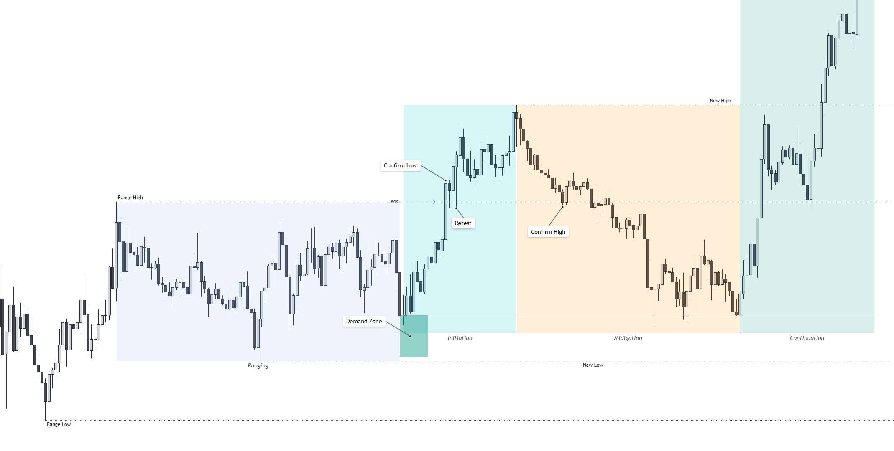

## Range – Wenn der Markt zur Ruhe kommt{#sec:ranges}

Der Markt bewegt sich nicht kontinuierlich in Trends. Ein Großteil der Zeit verbringt er in sogenannten __Ranges__ – Phasen, in denen weder Käufer noch Verkäufer einen klaren Vorteil haben. Der Preis schwankt zwischen definierten Extremen und kehrt immer wieder zu einem fairen Mittelwert zurück. Diese Seitwärtsphasen sind kein Stillstand, sondern ein zentraler Bestandteil der Marktmechanik: Sie bilden das Gleichgewicht zwischen Angebot und Nachfrage ab.

Für das Trading stellen Ranges eine eigene Dynamik dar. Während Trends durch Momentum und Richtung geprägt sind, dominieren in Ranges Struktur, Wiederholung und Kontext. Wer diese Unterschiede versteht, erkennt nicht nur potenzielle Übergänge zwischen Akkumulation und Expansion – sondern auch klare Handelsmöglichkeiten __innerhalb__ der Range. In diesem Kapitel analysieren wir:

- was eine Range strukturell ausmacht,
- welche Zonen für Angebot und Nachfrage innerhalb einer Range relevant sind,
- warum Begriffe wie Premium, Discount oder Equilibrium oft missverstanden werden,
- wie man objektive Werkzeuge wie Value Area, Point of Control oder Anchored VWAP nutzt,
- und warum das Handeln zwischen Zonen häufig sinnvoller ist als der Versuch, Extrema zu erwischen.

Dabei betrachten wir Ranges nicht nur als horizontale Strukturen, sondern auch als funktionales Verhalten. Denn unabhängig von ihrer Ausprägung erfüllen sie denselben Zweck: Sie zeigen, dass sich der Markt noch nicht entschieden hat – und in dieser Phase versucht, einen fairen Preis zu finden.
Oder funktional gesagt:__Preisfindung unter Unsicherheit__. Gleichzeitig dienen sie als Vorbereitung auf die nächste Bewegung: Wer in der Range richtig positioniert ist, wird vom nächsten Impuls getragen – wer falsch liegt, wird ausgespült.

Im weiteren Verlauf dieses Kapitels klären wir, wie sich diese Phasen erkennen, einordnen und gezielt handeln lassen – ohne in den Grabenkämpfen an den Extremen zerrieben zu werden.

### Was ist eine Range?

Eine Range entsteht typischerweise nach einem impulsiven Move – sie markiert eine Phase der Neuorientierung. Funktional entspricht sie oft einer Korrekturbewegung, die sich innerhalb der Spanne des letzten Swings abspielt. Hoch und Tief der Range lassen sich deshalb häufig direkt aus dem Swing High und Swing Low ableiten.

Innerhalb dieser Spanne pendelt der Preis hin und her. Käufer und Verkäufer sind vorerst im Gleichgewicht, der Markt rotiert – scheinbar richtungslos, tatsächlich aber voller Information. Diese Phasen sind kein Stillstand, sondern Ausdruck von Unsicherheit, Erwartung und Positionsaufbau. Wer versteht, was hier passiert, kann weit mehr ableiten als nur einen möglichen Ausbruch.

> Ranges sind funktionales Verhalten – keine Formationen

Viele Trader suchen im Chart nach klaren Mustern – Rechtecke, Dreiecke, Boxen. Doch eine Range ist keine geometrische Figur, sondern ein funktionaler Zustand: Der Markt zeigt durch sein Verhalten, dass er sich __noch nicht entscheiden will__. Das ist keine Schwäche, sondern Teil des Spiels.

Eine Range muss dabei nicht horizontal verlaufen. Auch flach steigende oder fallende Korrekturen – etwa Flags, Channels oder Dreiecke – erfüllen dieselbe Funktion: Der Markt tritt auf der Stelle, auch wenn er visuell weiterläuft. Volumen nimmt ab, Bewegungen verlieren an Kraft – der Markt sammelt Energie. Wir traden dabei nicht das Pattern selbst – aber wir identifizieren die Form, um die dahinterliegende Funktion zu entschlüsseln. Denn:

> Ranges zeigen keine Pattern, weil sie Formationen sind – sie zeigen Formationen, weil sie Funktionen erfüllen.

Ein Dreieck oder Channel ist kein Setup. Es ist der visuelle Ausdruck eines inneren Gleichgewichts, das sich irgendwann auflösen wird. Der Bruch ist unausweichlich – doch der gute Trade entsteht nicht beim bloßen Breakout, sondern __nach dem Bruch einer funktionalen Struktur__. Erst wenn klar ist, was gebrochen wurde – ein Swing High, ein Strukturpunkt, eine Reaktionszone – wird aus Bewegung Richtung.

> Struktur zeigt dir, was der Markt getan hat. Verhalten zeigt dir, was er gerade tut.

Diese Unterscheidung ist entscheidend: Die Marktstruktur lässt sich rückblickend sauber analysieren – Swing Highs, Breakouts, Retests. Doch sie sagt nur, wie der Markt bisher reagiert hat. Das Verhalten hingegen ist das, was im Moment geschieht: Tempo, Reaktion, Volumen, Absorption – die Sprache, in der der Markt seine aktuelle Haltung ausdrückt.

Wer z. B. sieht, dass ein Hoch gebrochen wird (Struktur), aber gleichzeitig erkennt, dass dies ohne Volumen geschieht, mit kleinem Candle-Body und sofortiger Ablehnung (Verhalten), oder direkt nach dem Breakout die Kerze wieder abverkauft wird, der weiß: Das ist kein echter Bruch – sondern ein Test. Oder ein Trick.

> Struktur kann dir eine Karte zeigen – aber nur Verhalten verrät dir, ob der Weg noch offen ist.

Deshalb handeln wir nicht einfach die Struktur, sondern warten auf verhaltensbasierte Bestätigung: Wer wurde aktiv? Wer hat reagiert? Was wird verteidigt – was aufgegeben? Trader, die das verstehen, traden nicht den Ausbruch selbst, sondern die __Bestätigung__, dass die Range tatsächlich verlassen wurde – strukturell, nicht nur optisch. 

> Manchmal wird ein Pattern gebrochen – nur damit sich ein neues Pattern bildet.

Denn auch der Bruch kann Teil der Unsicherheit sein. Solange keine Seite dominiert, bleibt der Markt in der Warteschleife – Muster um Muster, ohne Commitment.

#### Warum klassische Tools oft zu starr sind
Viele Tools zur Rangedefinition – wie automatische Boxen, RSI-Überlagerungen oder statische Volume-Indikatoren – sind mechanisch und rückblickend. Sie erkennen eine Range oft erst, wenn sie fast vorbei ist. Oder sie klassifizieren jede Seitwärtsphase als Range, selbst wenn sie nur ein flacher Pullback ist.

Besonders gefährlich wird es, wenn Indikator-basierte Strategien in solchen Phasen weiterarbeiten: Die meisten beruhen auf Trendverhalten – doch in Ranges wechselt der Trend ständig. Das Ergebnis: Fehlsignale, Stopouts, Frust.

> In den meisten Märkten und Zeitfenstern verbringen Preise mehr Zeit in Konsolidierung als im Impuls – mit Ausnahmen in starken Trendphasen

#### Warum Ranges entscheidend sind

Viele erkennen die Range zu spät – und wissen selbst dann nicht, wie sie mit ihr umgehen sollen. Dabei sind gerade diese Phasen der Schlüssel zur Struktur. In der öffentlichen Wahrnehmung sind es die impulsiven Bewegungen, die faszinieren – schnelle Rallys, saubere Breakouts. Doch wer Märkte ernsthaft analysiert, erkennt schnell: Der Großteil der Zeit besteht aus Ranges. Diese Phasen wirken richtungslos, sind aber das **Fundament jeder echten Bewegung**.

Sie sind der Ort, an dem sich Marktteilnehmer positionieren, Liquidität aufbauen und Meinungen aufeinandertreffen. Ohne Ranges kein Kontext – und ohne Kontext keine valide Struktur. Gerade weil der Markt hier unklar scheint, ist er besonders ehrlich: Wer erkennt, was gesammelt oder verteilt wird, erkennt oft auch, wohin der Markt will.

Ein besonderer Blick lohnt sich dabei auf __Wyckoff__: Kaum ein Konzept beschreibt Ranges so präzise wie seine Phasenmodelle von __Akkumulation__ und __Distribution__. Funktional bedeutet das:

- **Akkumulation**: Kaufinteresse überwiegt, große Marktteilnehmer bauen Long-Positionen auf. Sie zeigt sich häufig durch eine Serie höherer Tiefs innerhalb der Range, begleitend mit ansteigendem Volumen bei Aufwärtsbewegungen.
- **Distribution**: Verkaufsinteresse dominiert, Positionen werden über Zeit abgebaut. Sie hingegen manifestiert sich oft in Form niedrigerer Hochs, begleitet von erhöhter Aktivität beim Abverkauf.

Entscheidend ist dabei das Verhalten nach dem Test eines Extrempunkts: Reagiert der Markt impulsiv mit hohem Volumen? Wird das Level schnell zurückerobert oder nachhaltig verlassen? 

Nicht die Frage „Was sehe ich?“ bringt dich weiter – sondern „Wer handelt hier, und mit welcher Absicht?“ Wer versteht, in welchem Stadium sich der Markt befindet, steht mit hoher Wahrscheinlichkeit auf der richtigen Seite – und wird nicht durch Setup oder Analyse scheitern, sondern höchstens durch falsche Entries oder Stops. Die Deutung ist eine hohe Kunst. Sie erfordert nicht nur technisches Wissen, sondern Erfahrung, Kontext und Geduld. Akkumulation und Distribution sind keine Labels, die man einfach auf ein Rechteck klebt – sie sind das Ergebnis strukturierter Beobachtung über Zeit.

> Das Muster ist nicht die Wahrheit – es ist nur ein Symptom. Die Wahrheit liegt im Verhalten dahinter.

### Zonen einer Range

Die klassische Darstellung einer Range arbeitet mit drei festen Marken: oben das High, unten das Low, dazwischen die Midline – oft als 50 %-Marke. Damit entsteht eine einfache Zweiteilung:

- **Premium**: die obere Hälfte, in der der Preis als „teuer“ gilt.
- **Discount**: die untere Hälfte, wo er als „günstig“ erscheint.

Diese Sichtweise ist nicht falsch – im Gegenteil: Sie spiegelt das Grundprinzip jeder funktionierenden Marktstrategie.

> Buy low, sell high.

Das wussten schon die alten Römer – und vermutlich auch der erste Olivenhändler der Antike. Doch so hilfreich diese Einteilung für die Orientierung ist, sie bleibt oberflächlich. Denn Preis ist kein statischer Wert – sondern das Ergebnis eines Aushandlungsprozesses. Und deshalb reicht es nicht, den Markt geometrisch in zwei Hälften zu teilen. Was wir brauchen, ist ein Modell, das nicht nur wo, sondern auch warum unterscheidet.

#### Ein funktionaler Blick auf Ranges
Eine praxisnahe Einteilung betrachtet die Range nicht nur geometrisch – sondern funktional. Statt von zwei symmetrischen Hälften auszugehen, unterscheiden wir drei Zonen mit klarer Rolle:

- **Supply** (obere 25–30 %): Hier beginnt der Markt, hohe Preise zu hinterfragen. Ob durch aktiven Verkaufsdruck oder schlicht fehlendes Kaufinteresse – Die Marktreaktion wird plötzlich passiv. Der Preis „wickt“ über das High hinaus, scheitert oder wird direkt absorbiert. Oft entsteht hier der nächste Abwärtsimpuls – nicht weil es das High ist, sondern weil sich Verhalten ändert.

- **Fair Price** (mittlerer Bereich, etwa 30–70 %): Dieser Bereich steht für temporären Konsens. Hier treffen sich Angebot und Nachfrage – es passiert viel, aber bewegt sich wenig. Der Preis wird akzeptiert, Volumen häuft sich, aber ohne klare Richtung. Genau deshalb ist dieser Bereich gefährlich: Wer hier ohne Kontext handelt, verlässt sich auf Zufall. Im Unterschied zum oft dogmatisch gesetzten 50 %-Level im ICT/SMC-Kontext verstehen wir unter Equilibrium nicht einen exakten Wert, sondern eine Zone temporärer Akzeptanz – sichtbar durch Volumen und fehlende Richtung.

- **Demand** (untere 25–30 %): Hier beginnt der Markt, niedrige Preise abzulehnen – entweder durch aktives Kaufverhalten oder schlicht durch das Ausbleiben weiterer Verkäufe. Das kann sich durch steigendes Volumen zeigen, aber auch durch leises Stehenbleiben oder schnelle Gegenbewegungen. Wichtig ist nicht die Kerze – sondern die Reaktion.

In Ranges definieren sich Supply/Demand-Zonen also nicht durch Candle-Struktur, sondern durch Reaktionen auf Preisbereiche außerhalb der Value Area – idealerweise sichtbar durch Ablehnung, Volumenverschiebung und Mikrostrukturbruch.

#### Der funktionale Kern: Von den Rändern – nicht aus der Mitte
Ein häufiger Fehler: Trader suchen Entries am fairen Preis – aus der Mitte heraus. Aber genau dort passiert selten etwas Entscheidendes. In der Mitte wird verhandelt – an den Rändern wird entschieden.

Warum? Weil Institutionen, Algorithmen und größere Teilnehmer nicht im Zentrum testen – sondern an den Extremen. Sie pushen den Preis in die Zone, beobachten die Reaktion und entscheiden dann: __Akzeptiert der Markt diesen Preis – oder wird er zurückgewiesen?__ Wenn keine Akzeptanz entsteht, wird neu verhandelt. Der Preis kehrt zurück – oft zur Mitte, wo vorher Konsens herrschte. Deshalb handelt man nicht vom Zentrum zu den Extremen, sondern umgekehrt.

> Handel die Ablehnung am Rand – nicht die Ungewissheit in der Mitte.

Und genau daraus ergibt sich eines der zuverlässigsten Setups im gesamten Trading: **Wenn ein Extrem abgelehnt wird, ist der Rücklauf zur Mitte oft das wahrscheinlichste Szenario.** Nicht spektakulär, nicht sexy – aber stabil. Der Markt zeigt dir, wo er nicht hinwill. Und du nutzt diese Information, um dahin zu gehen, wo er vorher war. Kein Heldentrade. Kein Wunderindikator. Nur funktionales Denken.

#### Verhalten schlägt Struktur
Gerade an den Extremen zeigt sich, wie wichtig es ist, nicht auf den exakten Preis, sondern auf die Reaktion zu achten. Es reicht nicht aus, eine Zone einzuzeichnen und blind darauf zu setzen. Man muss beobachten, wie der Markt dorthin kommt – und was dann passiert. Diese Muster verraten uns, was der Markt gerade verhandelt – und wohin er als Nächstes tendiert:

- Bricht der Preis impulsiv durch, ohne Zurückhaltung, ist das ein Zeichen von Stärke – der Markt akzeptiert das neue Niveau und will weiter in diese Richtung.
- Wird er absorbiert, also gestoppt oder umgedreht, zeigt das, dass dort jemand aktiv geworden ist.
- Bleibt der Preis stehen oder beginnt seitwärts zu laufen, entsteht Akzeptanz – ein Hinweis darauf, dass der faire Preis sich verschiebt.

#### Von der Zone zur Quantifizierung
Die Einteilung in Supply, Fair Price und Demand ist eine funktionale Heuristik – ein Modell, das hilft, Verhalten zu deuten. Aber sie beantwortet nicht die Frage, wo genau diese Zonen beginnen oder enden. Denn Märkte halten sich nicht an Lineale – sie reagieren auf Liquidität, Volumen, Erwartung und Zeit. Deshalb braucht es etwas, das mehr ist als Geometrie. 

Hier kommt das Volume Profile ins Spiel. Mit Konzepten wie __Value Area__, __VAH__ (Value Area High), __VAL__ (Value Area Low) und __POC__ (Point of Control) wird sichtbar, wo der Markt tatsächlich gelebt hat – nicht nur, wo der Preis war. Das Volumen verrät uns, wo Einigkeit herrschte, wo Kämpfe stattfanden und wo der Markt vielleicht nur kurz hineingefühlt hat.

> Preis ist Meinung. Volumen ist Abstimmung.

Diese Tools helfen uns, die drei Zonen nicht nur subjektiv zu fühlen, sondern objektiv zu messen. Sie machen sichtbar, was Supply und Demand oft nur andeuten: Wer hat hier wirklich gehandelt – und mit welcher Überzeugung?

### Objektive Bewertungsmethoden

Im vorherigen Abschnitt haben wir Ranges funktional in drei Zonen unterteilt: Demand, Fair Price und Supply. Doch so sinnvoll diese Einteilung ist – sie bleibt subjektiv, solange wir sie nur fühlen, aber nicht messen. Genau hier kommt das Volume Profile ins Spiel. Es liefert uns eine objektive Grundlage für die Frage: Wo wurde tatsächlich viel gehandelt – und wo nicht? Und damit auch: Wo wurde akzeptiert – und wo reagiert?

#### Value Area as Fundament

Die Value Area (VA) bildet den Kern der Marktaktivität. Sie zeigt, wo rund 68 % des Volumens lagen – also wo der Markt Einigkeit gefunden hat. Die Grenzen dieser Zone, VAH (oben) und VAL (unten), markieren funktional die Übergänge vom Konsens in den Konflikt (siehe [@subsec:volume_profile]). Aber – und das ist entscheidend – sie sind keine Supply- oder Demand-Zonen im engeren Sinne. Denn die eigentlichen Reaktionen finden oft darüber oder darunter statt.

> Der Markt testet nicht nur, was er kennt – er fühlt in das hinein, was er noch nicht akzeptiert hat.

Wenn du dir ein typisches Volume Profile einer Range anschaust, siehst du oft einen großen Bauch (die Value Area) und darüber bzw. darunter kleinere Volumenbuckel. Diese kleinen Ausbuchtungen entstehen durch erste Reaktionen – kurze Pushes, schnelle Ablehnung oder zaghafte Annäherung. Und genau dort liegen häufig die entscheidenden Zonen. Wir könnten sie funktional so beschreiben:

- Oberhalb von VAH: Potenzielle Supply-Zone, wenn der Markt dort „hinfühlt“, aber keine Akzeptanz aufbaut.
- Unterhalb von VAL: Potenzielle Demand-Zone, wenn der Preis dort stößt und sofort wieder zurückkehrt.
- Am POC: Zentrum des Konsens – hilfreich für Zielzonen, aber selten ein guter Entry.

Diese kleinen Volumencluster über und unter der Value Area sind Reaktionsbereiche, keine Verhandlungszonen. Sie sind der erste Hinweis darauf, dass der Markt dort versucht hat, aber (noch) keine Einigung gefunden hat.

#### Beispielhafte Interpretation: der „Bauch-mit-Flügeln“-Effekt

Ein Volume Profile mit ausgeprägtem Mittelteil (Value Area) und kleinen Volumenbuckeln darüber und darunter sieht aus wie ein „Bauch mit Flügeln“. Das ist kein Chartpattern – aber ein wiederkehrendes Muster (vgl. [@fig:vr_range]). Funktional bedeutet das:

- Der Markt hat sich in der Mitte auf etwas geeinigt.
- Er hat in beide Richtungen getestet.
- Aber die Reaktionen an den Extremen waren stark genug, um keine Akzeptanz aufzubauen.

Das ist dein Setup. Genau dort entstehen die besten Chancen für den Trade „vom Rand zur Mitte“.

#### Struktur braucht Zeit
Ein häufiges Missverständnis beim Einsatz des Volume Profiles ist, sofort handeln zu wollen, sobald sich eine Range andeutet. Doch ein funktionales Profile entsteht nicht in drei Kerzen. Es braucht Zeit, Volumen und Preisverhandlung. Ohne das bist du blind im Nebel.

> Du kannst keine Value Area analysieren, wenn es noch keinen Wert gibt.

Deshalb gilt: **Geduld vor Analyse**. Lass den Markt zuerst sprechen – bevor du zuhörst. Eine gute Range erkennt man nicht an der Symmetrie, sondern an der Reife. Und nur dann macht das Volume Profile wirklich Sinn.

{#fig:vr_range}

In dem Beispiel in [@fig:vr_range] siehst du eine klassische Seitwärtsphase mit klar definiertem Range High (Supply-Zone) und Range Low (Demand-Zone), eingerahmt durch zwei farblich markierte Bereiche. Dazwischen bildet sich über die Zeit eine stabile Value Area heraus, die sich sichtbar verschiebt – ein Hinweis darauf, wie der Markt neu bewertet und wo er Konsens findet. Der Point of Control (POC) wandert dabei leicht nach oben, was funktional einer schleichenden Akzeptanz höherer Preise entspricht – ohne dass es direkt zu einem Ausbruch kommt. Besonders spannend: Das Volumen am unteren Bildrand zeigt immer dann erhöhte Aktivität, wenn der Preis innerhalb der Range aufwärts läuft. Dieses Verhalten deutet auf eine Akkumulation hin – Käufer sind aktiv, wenn der Preis günstig ist, aber es fehlt (noch) der strukturelle Ausbruch nach oben.

> Akkumulation erkennt man nicht an Mustern – sondern am Verhalten unter der Oberfläche. Wenn der Preis günstig ist und gleichzeitig hohes Volumen auftritt, will jemand was haben. 

**Achtung**: Nicht jedes Volume-Cluster mit Reaktionen an den Rändern ist automatisch eine Akkumulation.

#### Nicht jede Range ist ein Setup

Auch wenn ein Volume Profile mit „Bauch und Flügeln“ visuell nach Akkumulation aussieht – das reicht nicht für eine valide Interpretation. Solche Strukturen können genauso gut eine Distribution sein. Die Entscheidung hängt nicht vom Shape ab, sondern vom Verhalten im Profil – und im größeren Kontext. Deshalb gilt:

- Ohne strukturelle Einordnung auf dem Higher Timeframe ist jede Interpretation spekulativ.
- Ohne Volumenanalyse der internen Bewegungen fehlen Hinweise auf aktives Interesse.
- Ohne Reaktion an den Rändern fehlt der Beweis für funktionale Zonen.

Das Ziel großer Marktteilnehmer ist es, Positionen aufzubauen oder abzubauen – ohne dabei den Preis zu bewegen. Dafür brauchen sie Liquidität, und die entsteht am ehesten dort, wo andere Marktteilnehmer denken, dass „nichts passiert“. Ranges sind daher oft kein neutraler Zustand, sondern Vorbereitung auf den nächsten Impuls. Aus Trader-Sicht bleiben zwei funktionale Umgangsweisen:

- Ausbruch handeln: Erst nach klarer Strukturveränderung und Volumenbestätigung. Kein Antizipieren.
- Rücklauf zur Mitte: Reaktion an der Rangegrenze → Einstieg → Ausstieg am PoC. Kein Trend erwarten.

> Eine Range ist kein Trend. Wer in der Mitte auf Fortsetzung setzt, handelt Hoffnung – kein Setup.

### Dynamische Ranges entlang des Trends{#subsec:dynamic_range}

Nicht jede Range ist horizontal. Märkte konsolidieren auch in Bewegung – oft als Flagge, Channel oder Keil. Funktional unterscheidet sich das Verhalten kaum: Auch hier verhandelt der Markt Preis und Wert unter Unsicherheit. Der Unterschied liegt nur im Gefälle.

> Ob seitwärts oder schräg – das Ziel bleibt dasselbe: Liquidität für die nächste Bewegung.

Solche __dynamischen Ranges__ erkennt man an wiederholten Reaktionen entlang einer schrägen Struktur. Dabei oszilliert der Preis zwischen einer Art oberen und unteren Begrenzung, ohne echte Akzeptanz außerhalb aufzubauen. Visuell wirken sie wie Mini-Trends, doch funktional sind sie Pausen – keine Richtungsentscheidungen.

#### Muster ≠ Bedeutung

Ein häufiger Trugschluss liegt darin, klassischen Mustern wie „bullish Flag“ oder „descending Channel“ pauschal eine Richtung zuzuordnen. In der Realität bricht ein „fallender Channel“ nicht automatisch nach oben aus – genauso wenig wie ein „steigender Keil“ immer bearish endet.

> Das Pattern zeigt das Verhalten. Die Bedeutung ergibt sich aus dem Kontext.

Ein descending Channel sieht für viele wie ein bullishes Reversal-Muster aus – genau wie es in zahllosen Pattern-Guides gelehrt wird. Doch das allein ist noch keine Edge. Denn: Was du siehst, sehen auch alle anderen. Und damit auch die, die Liquidität brauchen.

> Marktteilnehmer mit Volumen kennen die Assoziationen – und nutzen sie gezielt.

Wenn viele Trader im Channel long positionieren „weil das jetzt bestimmt gleich nach oben ausbricht“, gibt es dort eines im Überfluss: Stops. Und genau diese Liquidität kann genutzt werden – für den echten Move, oder für einen Fakeout, um eine Position aufzubauen:

- Der Channel bricht nach unten aus, stoppt Longs aus → springt dann sofort zurück → klassischer Fakeout zur Akkumulation.
- Oder er bricht tatsächlich durch, weil die Struktur bricht und darunter echte Verkaufsabsicht liegt → Distribution.

Beides ist möglich – das Bild ist gleich, die Bedeutung ist entgegengesetzt. Entscheiden ist:

- Der Kontext (Trend, Struktur, Supply/Demand),
- die Zone, in der sich das Muster befindet,
- und das Verhalten beim Ausbruch (Momentum? Ablehnung? Retest?).

Es geht nicht um das Muster – es geht darum, wer gerade Liquidität braucht, und wie er sie bekommt. Deshalb sind Ranges, Channels und Keile nicht Signale an sich, sondern Verhandlungsräume. Wer nur auf das Pattern schaut, tradet Symbole. Wer auf das Verhalten schaut, erkennt Absicht (vgl. [@fig:acending_range]).

#### Schwächen klassischer Tools
Viele Werkzeuge wie das Volume Profile sind auf horizontale Ranges ausgelegt. In einem Trendkanal entstehen zwar auch Value Areas, doch sie sind verzerrt und verschoben. Der POC wandert mit, das Profil wirkt verwaschen – oft entsteht der Eindruck, es gäbe keinen klaren Konsens. Das Problem: __Das Tool folgt der Form – nicht dem Verhalten__.

Ein horizontales Volume Profile misst in Zeitblöcken (Session, Tag, Woche), unabhängig vom Trendverlauf. In einer dynamischen Range, die sich über mehrere Tage nach oben zieht, liegt der eigentliche Konsens aber oft entlang einer Linie – nicht entlang eines Zeitblocks. Klassische Werkzeuge übersehen diesen Zusammenhang.

#### Anchored VWAP als funktionaler Kompass
Der Anchored VWAP (Volume Weighted Average Price) ist eine Alternative, um Wert entlang einer Bewegung sichtbar zu machen. Er wird von einem spezifischen Punkt aus verankert – etwa einem Bruch, einem strukturellen Hoch/Tief oder dem Start einer Trendphase. Vereinfacht gesagt: Während das Volume Profile zeigt, wo Volumen stattfand, zeigt der VWAP, zu welchem Preis das Volumen durch­schnittlich realisiert wurde – bezogen auf eine bestimmte Phase.

Das macht ihn zu einem dynamischen Referenzwert, besonders hilfreich in folgenden Situationen:
- Bei Pullbacks innerhalb eines Trends – der VWAP dient oft als Magnet oder Verteidigungslinie.
- In Flags und Channels – dort zeigt er, ob der Markt die Bewegung weiterhin akzeptiert oder bereits infrage stellt.
- Nach einem Break of Structure – ein von dort verankerter VWAP markiert den Durchschnittseinstieg der „neuen Struktur“.

Ein steigender VWAP zeigt, dass Käufer zu immer höheren Preisen bereit sind zu handeln – die Akzeptanz bewegt sich mit dem Trend. Ein Bruch oder Unterschreiten deutet darauf hin, dass diese Akzeptanz verloren geht. Gerade in dynamischen Ranges kann ein flacher oder abknickender VWAP ein frühes Warnsignal sein: Der Markt verhandelt neu – möglicherweise gegen die bisherige Richtung.

Der Anchored VWAP ist aber kein magischer Durchschnitt – sondern ein Spiegel dessen, von wo aus Marktteilnehmer bereit waren, Volumen in Bewegung zu bringen. Seine Aussagekraft hängt komplett vom gewählten Ankerpunkt ab. Ein VWAP, der von einem strukturprägenden Tief, einem Break of Structure, einer News-Kerze oder einem Gap-Beginn gezogen wird, erzählt jeweils eine andere Geschichte. Und genau hier liegt die Gefahr: Wer VWAPs ohne Kontext interpretiert, vergleicht Äpfel mit Ideologie. Funktional betrachtet:

- Ein VWAP vom Swing Low zeigt, ob Käufer ihren Einstieg verteidigen – besonders bei Pullbacks.
- Ein VWAP ab Breakout (z. B. BoS) visualisiert den volumengewichteten Durchschnitt der neuen Strukturphase.
- Ein VWAP ab Liquiditätsereignis (z. B. Sweep oder News) kann zeigen, ob ein Move auf realem Interesse basiert oder nur emotional war.

Der Ankerpunkt entscheidet, welche Marktteilnehmer du beobachtest – und ob du den Kontext ihrer Positionierung überhaupt verstehst. Deshalb gilt: Nicht der VWAP liefert dir den Bias – sondern die Frage, wem dieser Durchschnitt gehört.

#### Funktionale Hinweise in der Praxis erkennen
Damit du in einer dynamischen Range nicht auf die Verpackung hereinfällst, sondern die Absicht erkennen kannst, helfen dir folgende Kriterien – nicht als Setup, sondern als diagnostisches Werkzeug:

Mögliche Anzeichen für Akkumulation:

- Steigendes Volumen bei Abwärtsbewegung innerhalb der Range (Käufer treten aktiv auf).
- Reaktion am unteren Ende (VAL, Demand-Zone) mit sofortigem Reversal.
- Spring mit starker Rejection und anschließendem Mikrostrukturbruch (BoS).
- Anchored VWAP wird reclaimt oder unterstützt.
- Untere Liquidität wird abgeholt, aber nicht akzeptiert – Preis zieht impulsiv zurück.

Mögliche Anzeichen für Distribution:

- Steigendes Volumen bei Aufwärtsbewegung innerhalb der Range (Stärke wird abverkauft).
- Upthrust mit klarer Ablehnung und folgendem Bruch interner Struktur nach unten.
- Anchored VWAP verhindert Re-Akzeptanz von oben.
- Reaktion am Range-High mit tieferen Hochs → Zeichen für nachlassende Nachfrage.
- Hochs werden angelaufen, aber nicht überschritten → Momentumverlust.

Auf den ersten Blick wirkt das Pattern in [@fig:acending_range] wie eine klassische „Rising Wedge“ – ein bärisches Signal, das den Markt nach unten auflösen müsste. Viele Trader, die ausschließlich auf das visuelle Muster schauen, sehen:

- eine „Überdehnung nach oben“,
- eine eng werdende Struktur (Verlust an Momentum),
- und eine Trendlinie mit mehrfachen Berührungen – also klassische Voraussetzungen für einen Short.

Doch genau hier liegt der Trugschluss: Das Pattern ist nur die Verpackung – der Kontext entscheidet über die Bedeutung. Was in [@fig:acending_range] passiert, ist kein echter Breakdown, sondern ein gezielter Shakeout, der Longs auf dem falschen Fuß erwischt – und Shorts erst recht. Warum? Die funktionalen Hinweise im Chart zeigen es deutlich:

- Der Preis bleibt während der gesamten Struktur über dem Anchored VWAP, was auf fortbestehende Akzeptanz hinweist.
- Der Point of Control steigt langsam an – ein Zeichen, dass sich der volumengewichtete Konsens mit dem Preis nach oben verschiebt.
- Der Rücksetzer (Fakeout) bricht keine Mikrostruktur, sondern wird direkt am POC absorbiert.
- Kein aggressives Volumen beim Bruch, sondern eher Zurückhaltung – ein Hinweis auf mangelndes Commitment der Bären.

Klassische Pattern-Trader gehen hier short – weil sie ein Symbol sehen. Smarte Trader erkennen, dass der Markt sich nur Liquidität abholt, um den echten Move zu starten. Die Folge: Während Retail-Trader ihre Shorts eröffnen, bauen größere Teilnehmer gezielt Longs auf – nicht trotz, sondern wegen des vermeintlichen Breakdown-Patterns. Der anschließende Move von 75k auf 90k ist damit kein Ausbruch – sondern die logische Konsequenz eines Positionsaufbaus unter dem Radar. 

**Funfact**: Ich habe diesen Trade verpasst, weil ich Struktur über Verhalten gesetzt habe. Mein Plan: Der Markt sollte erst die Trendline-Liquidität unten abräumen, dann sauber in meine Demandzone dippen – und dann bitte textbook-like nach oben laufen. SMC-Style, perfekt. Nur: Der Markt hatte andere Pläne. Kein Sweep. Kein Dip. Einfach direkt hoch. Und ich? Ich saß daneben, wartete auf mein Setup – statt auf das Verhalten zu reagieren. Und schaute nur noch dem Preis hinterher.

{#fig:acending_range}

Nicht jede Range ist ein Trade – aber jede gute Range ist ein Hinweis. Vor allem auf dem höheren Zeitrahmen (HTF) liefert eine stabile Range oft die Leitplanken für das, was auf dem kleineren Zeitrahmen (LTF) passiert. Das heißt aber nicht, dass man jede Seitwärtsphase aggressiv handeln sollte. Im Gegenteil:

> Die meisten Fehler passieren, weil man in der Mitte der Unklarheit auf den großen Move spekuliert – statt geduldig auf die Klärung der Absicht zu warten.

Deshalb lohnt sich aus unserer Sicht oft der strategische Verzicht:

> Trendphasen sind einfacher zu handeln als Ranges. Es lohnt sich, zu warten.

Eine Range ist keine Endstation – sie ist eine Vorbereitung. Sie erzeugt die Liquidität, die es braucht, um einen neuen Impuls zu starten.Und genau da setzen wir an: Im nächsten Abschnitt schauen wir uns an, wie sich Märkte aus solchen Gleichgewichtszonen heraus bewegen.

### Der RIMC-Zyklus{subsec:rimc}

Der Markt bewegt sich nicht in endlosen Trends – sondern in wiederkehrenden Funktionszyklen. Impuls, Korrektur, Folgeimpuls – das ist kein Pattern, sondern ein **strukturelles Grundprinzip**. Preisentwicklung kann wie folgt einfach beschrieben werden:

- In der Range wird Position aufgebaut.
- Ein starker Impuls, der die Range verlässt, signalisiert die erste Intention.
- Die nachfolgende Korrektur testet Liquidität und Commitment.
- Erst der Folgeimpuls treibt die Bewegung nachhaltig weiter.

Du findest diese Struktur überall – im 5-Minuten-Chart, auf Tagesbasis oder an historischen Wendepunkten. Sie ist nicht immer sichtbar, aber immer wirksam. Denn Märkte brauchen Liquidität. Und Liquidität findet sich dort, wo der Markt schon einmal bereit war zu handeln – also an früheren Akzeptanzzonen, in denen bereits Volumen aufgebaut wurde.

Genau dieses Verhalten wurde von James Dalton im Market Profile beschrieben: Der Preis tendiert dazu, zu Bereichen zurückzukehren, in denen zuvor hoher Umsatz stattfand, weil dort zuvor Marktteilnehmer bereit waren, Preise zu akzeptieren. Auch wenn der Begriff __Value Revisit__ nicht als offizieller Terminus verwendet wird, ist das zugrunde liegende Prinzip ein zentraler Bestandteil seiner Theorie.

Und Dalton ist nicht allein: Auch Elliott – ohne es explizit zu benennen – hat schon in seiner Wellenstruktur genau dieses Prinzip abgebildet. Jeder Impuls wird korrigiert, und jede Korrektur ist letztlich nur der Weg zurück zum Perceived Value, bevor der nächste Impuls startet. Selbst Wyckoff beschreibt in seinen Akkumulations- und Distributionsphasen den Bruch einer Zone, die Rückkehr zur Akzeptanz – und den folgenden Expansionsimpuls.

> Wo Akzeptanz war, entsteht Interesse. Wo Interesse war, entsteht Reaktion.

**RIMC** ist ein Begriff aus der Smart-Money-Welt (SMC) zur funktionalen Beschreibung der grundlegenden Marktphasen. Es ist kein neues Konzept – sondern ein modernes Label für ein wiederkehrendes Verhalten, das bereits in älteren Modellen sichtbar ist. Wir nutzen den Begriff hier als funktionales Werkzeug, um scheinbar komplexe Marktmodelle auf ihr gemeinsames Grundprinzip zurückzuführen: **Rückkehr zum Value. Fortsetzung der Absicht.** Die vier Phasen von RIMC lassen sich wie folgt beschreiben: 

1. **(R)ange** (das Fundament): In der Range entsteht Gleichgewicht. Hier treffen unterschiedliche Interessen aufeinander: Käufer und Verkäufer handeln aktiv, aber ohne klare Dominanz. Diese Phase ist kein Leerlauf – sondern Vorbereitung. Wer hier aufmerksam ist, erkennt, wo Position aufgebaut wird, und welche Zonen potenziell verteidigt oder angegriffen werden. In der Value Area entsteht das Fundament - __die Basis__ - für die nächste Bewegung.

2. **(I)nitiation** (Der erste Vorstoß): Ein impulsiver Ausbruch aus der Range zeigt Absicht. Dieser erste Move - begleitet von einem Strukturbruch – ist das Signal, dass eine Seite die Kontrolle übernimmt. Es geht nicht um das Muster, sondern um das Momentum: Die Initiation zeigt, wohin der Markt will. Sie ist nicht einfach nur eine starke Bewegung – sie ist der erste funktionale Ausdruck eines Machtwechsels: Wer übernimmt den Markt? Das unterscheidet sie vom bloßen Impuls, der visuell sichtbar, aber strukturell bedeutungslos sein kann.

3. **(M)itigation** (Rücklauf mit Absicht): Der Markt kehrt zurück – aber nicht zufällig. In dieser Phase werden vorherige Zonen erneut angelaufen, um Liquidität zu testen, Positionen zu managen oder schwache Hände aus dem Markt zu drängen. Hier entscheidet sich, ob das erste Signal valide war. Oft sehen wir Reaktionen an alten Demand-Zonen, Range-Grenzen oder Value Areas. Die Mitigation ist kein Rückfall – sondern Teil der Struktur. Der Begriff Mitigation stammt ursprünglich aus der SMC/ICT-Welt, beschreibt aber funktional etwas Universelles: die Rückkehr zu einer vorherigen Zone mit dem Ziel, Restliquidität aufzunehmen oder neue Orders zu platzieren.

4. **(C)ontinuation** (Die Chance): Sobald der Markt nach der Mitigation erneut anzieht, beginnt die entscheidende Phase für Trader: die Continuation. Hier zeigt sich, ob der Markt die vorherige Struktur wirklich akzeptiert und fortsetzt. Und genau hier liegt der Moment, in dem ein Einstieg sinnvoll wird. Wenn eine klare Basis geformt wurde, ein erster Initiationsimpuls sichtbar ist und der Rücklauf (Mitigation) gehalten hat, entsteht ein echtes Setup. Die Continuation ist kein Zufallsprodukt, sondern der strukturelle Moment, an dem sich Intention in Bewegung übersetzt – und Risikomanagement mit Kontext möglich wird.

Diese Dynamik bildet die Grundlage für das Verständnis vieler scheinbar komplexer Marktbewegungen – über alle Zeitebenen hinweg. Die vier Phasen von RIMC lassen sich nicht nur beschreiben, sondern auch visuell nachvollziehen – wie in Abbildung [@fig:rimc] zu sehen. Das Schaubild fasst die zyklische Logik des Modells zusammen und zeigt, wie Preis, Liquidität und Struktur ineinandergreifen.

 __RIMC ist aber kein festes Gesetz – sondern ein konzeptionelles Modell.__ Es beschreibt wiederkehrende Verhaltensmuster im Markt, die sich aus der Dynamik von Angebot und Nachfrage ergeben. Nicht jede Bewegung passt perfekt in dieses Schema – aber wer den Markt so liest, erkennt Struktur statt Chaos. Es gilt: Nicht jede Range wird zurückerobert. Manche Zonen bleiben offen – bis zur nächsten Korrektur, dem nächsten Bärenmarkt oder vielleicht für immer. Doch das ändert nichts am Prinzip. Märkte brauchen Liquidität – und Liquidität entsteht dort, wo bereits Wert gesehen wurde.

> RIMC ist keine starre Schablone – sondern ein funktionales Denkmodell. 

{#fig:rimc}
