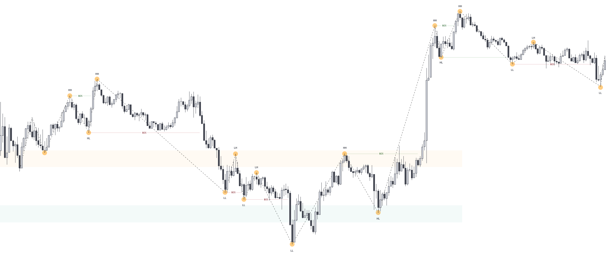
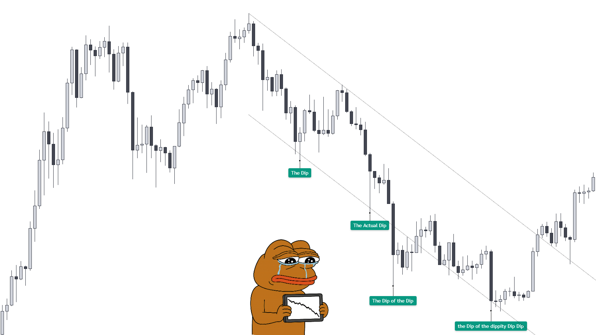
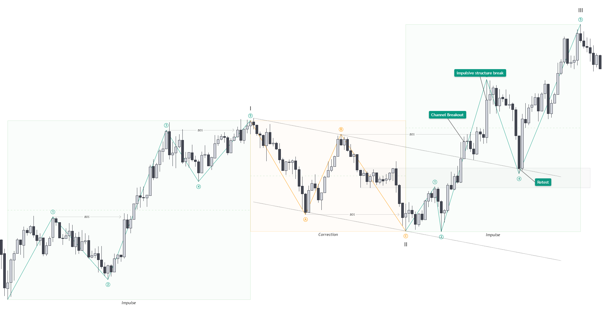

## Swings, Brüche, Impulse

Um Struktur lesen zu können, musst du verstehen, wer gerade führt – und wer nur reagiert. Der Markt bewegt sich ständig. Aber nicht jede Bewegung ist gleichbedeutend. Ein echter Richtungswechsel ist etwas anderes als ein kurzer Rücklauf. Deshalb unterscheiden wir zwischen **Impuls** und **Korrektur**. Doch bevor wir diese Begriffe einführen, brauchen wir ein gemeinsames Fundament.

### Strukturpunkte: Die Bausteine der Lesart

Was viele „Swings“, „Pivots“ oder „Wellen“ nennen, bezeichnen wir bewusst als **Strukturpunkte**. Ein Strukturpunkt ist ein markanter Wendepunkt im Marktverlauf – ein Punkt, an dem der Preis seine Richtung ändert. Aber: _Nicht jede Richtungsänderung ist automatisch ein relevanter Strukturpunkt_. Strukturpunkte entstehen nicht durch Form, sondern durch Funktion. Sie markieren Stellen, an denen der Markt nicht einfach nur stoppt oder kurz dreht, sondern _etwas Bedeutendes geschieht_: eine Bewegung wird gebrochen, eine neue Phase beginnt, oder es kommt zu einer klaren Reaktion – etwa durch starkes Volumen, ein impulsives Gegensignal oder eine auffällige Preiszunahme.

> Ein Strukturpunkt ist nicht einfach da – er wird im Verlauf bestätigt.

Deshalb unterscheiden wir zwei Typen:

- **Potenzielle Strukturpunkte** sind Stellen, an denen der Markt zunächst sichtbar dreht.
Sie könnten wichtig werden – aber wir wissen es noch nicht.
- **Bestätigte Strukturpunkte** sind solche, die sich im Nachhinein als bedeutungsvoll herausstellen.
Etwa, weil sie eine Folgebewegung auslösen oder weil der Markt erneut auf sie reagiert.

Diese Unterscheidung mag auf den ersten Blick akademisch wirken – ist aber essenziell. Denn viele Bewegungen wirken wie Swings, sind aber nur Rauschen. Ein Hoch sieht schnell aus wie ein Wendepunkt. Doch erst wenn der Markt anschließend etwas daraus macht, wissen wir:
Dort wurde nicht nur gedreht. Dort wurde entschieden. Ein Strukturpunkt ist also keine optische Markierung, sondern ein funktionaler Abdruck echten Marktverhaltens. Er zeigt: _Hier wurde Interesse sichtbar. Hier wurde eine Absicht umgesetzt._

Ein scheinbares Higher High mitten in einer Range ist kein Trendstart. Ein markantes Tief ohne Folgebewegung ist kein Wendepunkt. Ein Strukturpunkt zählt nur dann, wenn der Markt ihm Bedeutung gibt.

> Struktur ist nicht statisch – sie ist der Abdruck einer Entscheidung, erkennbar erst im Zusammenhang mit dem, was vorher und danach passiert.

### Trend – Wenn der Markt sich organisiert

Strukturpunkte sind die Bausteine – aber was ergibt sich daraus? Sobald diese Punkte eine erkennbare Abfolge bilden, spricht man von einem Trend. Ein Trend ist keine Linie, die man einzeichnet. Er ist eine Bewegung, die sich wiederholt durchsetzt – sichtbar durch aufeinanderfolgende Strukturpunkte, die in dieselbe Richtung weisen.

Ein **Aufwärtstrend** zeigt sich durch höhere Hochs (Higher Highs, _HH_) und höhere Tiefs (Higher Lows, _HL_) – ein **Abwärtstrend** durch das Gegenteil (tiefere Tiefs (Lower Lows, _LL_) und tiefere Hochs (Lower Highs, _LH_)). Entscheidend ist dabei nicht nur, dass diese Punkte existieren – sondern dass sie funktional Bedeutung tragen:

- Ein neues Hoch muss ein vorheriges relevantes Hoch überwinden – und
- Ein neues Tief muss halten, also vom Markt klar zurückgewiesen werden.

Diese Abfolge macht die Dynamik sichtbar: _Eine Seite setzt sich wiederholt durch_, während die Gegenseite ihre Strukturpunkte nicht verteidigen kann. Das ist kein Zufall – sondern funktionaler Ausdruck von Absicht (siehe Abbildung [@fig:swings]).

{#fig:swings}

#### Was ist ein Bruch?
Ein Bruch liegt vor, wenn der Markt ein bedeutendes vorheriges Hoch oder Tief klar überschreitet oder unterschreitet – und diese Bewegung nicht nur durch einen Docht andeutet, sondern mit Kraft und Konsequenz vollzieht. Dabei zählt nicht nur das Überschreiten eines Preispunktes, sondern ob eine Seite _Kontrolle übernimmt_.

Ein echter Bruch:
- durchläuft ein relevantes Level,
- wird idealerweise verteidigt (z. B. durch Retest),
- und erzeugt Folgeverhalten (z. B. erneuten Impuls).

> Ein Bruch ohne Folgereaktion ist kein Trendstart – sondern nur ein Ausschlag.

Für einen **gescheiterten Bruch** wird oft der Begriff _Liquidity Sweep_ verwendet. Dieser stammt aus dem ICT-Kosmos und suggeriert, der Markt würde gezielt Trader „ausstoppen“. In Wahrheit steckt dahinter ein bekanntes Konzept: Der Markt überschreitet ein altes Hoch oder Tief, löst dort liegende Stop-Orders aus – doch der entstehende Druck wird von Limit Orders (z. B. _Iceberg-Orders_) **absorbiert**. Das Preislevel wird dadurch **verteidigt**: Die Kraft reicht nicht aus, um nachhaltige Akzeptanz über dem Extrem zu erzeugen. Der Markt kehrt daraufhin impulsiv in die vorherige Struktur zurück. 

Funktional betrachtet handelt es sich um ein _Swing Failure Pattern_ (**SFP**) - also einen Bruch ohne Akzeptanz, oft sichtbar auf dem LTF, während der HTF intakt bleibt (siehe [@fig:SFP]). Oder wie Andreas Cimi es sinngemäß formuliert:

> „Es gibt keine Liquidity Sweeps. Der Markt testet eine Region – und wird dort von anderen verteidigt.“

Dabei ist es wichtig zu verstehen: _Liquidität existiert nicht nur an Hoch- und Tiefpunkten_, sondern im gesamten Markt. Besonders dort, wo viele Transaktionen stattfinden – rund um den sogenannten fairen Preis. Ein Blick ins Volume Profile zeigt: Die meisten Orders werden nicht an den Extremen gefüllt, sondern irgendwo in der Mitte, wo Akzeptanz herrscht.

Wenn ein Ausbruch fehlschlägt, kann das zwei funktionale Gründe haben:

- **Ermüdung**: Der Ausbruch findet keine Anschlusskäufer – die Bewegung stirbt mangels Interesse.
- **Verteidigung**: Limit-Seller absorbieren aktiv den Orderflow – etwa über Iceberg- oder Layering-Techniken.

Die Vorstellung, jemand würde Milliarden bewegen, nur um ein paar Retail-Stops zu holen, ist nicht nur unrealistisch – sie verkennt die tatsächliche Marktmechanik. Für viele Trader wirkt ein solches Verhalten wie eine „gezielte Falle“. In Wahrheit offenbart sich hier nur, wie eng Preisverhalten und psychologische Trigger (z. B. Breakout-Trading) zusammenhängen. Wer den Kontext ignoriert, interpretiert Absicht, wo nur Reaktion war.

> Frage zum Mitnehmen: _Warum legst du deinen Stop dorthin, wo der Markt Support oder Resistance testet?_ Weil du denkst, dort sei deine Idee invalidiert? Weil du gelernt hast, "da muss er drehen"? 

Wer seinen Stop an offensichtliche Strukturpunkte legt, vertraut darauf, dass diese Zonen halten. Doch gerade dort werden Entscheidungen provoziert: Eintritte, Exits, Panik, Reversals. Wenn du deinen Stop in diese Zone legst, positionierst du dich dort, wo Reibung entsteht – wo sich der Konflikt zwischen Käufern und Verkäufern zuspitzt. Und genau dort kommt es oft zu gescheiterten Bewegungen.

> "Place your entry where others have their stop loss – and watch what happens." (David Paul)

Was ich aus eigener Erfahrung gelernt habe: _Platzier deinen Entry dort, wo die Entscheidung schon gefallen ist._ enn erst wenn der Markt gezeigt hat, wer dominiert, beginnt echtes Risiko mit kalkulierbarem Vorteil. Wichtig:

- Der Preis „holt“ nicht aktiv Liquidität. Er _reagiert_ auf Zonen mit hoher Orderdichte.
- Dieses Verhalten ist _normale Marktmechanik_ – keine Absicht, keine Manipulation.
- Die Reaktion hängt vom _Kontext_ ab: Trend, Struktur, Volumen, Timeframe.

Wir verzichten im Buch bewusst auf den Begriff Liquidity Sweep. Stattdessen beschreiben wir das Verhalten _neutral und funktional_ – als das, was es ist: Ein _Fehlbruch mit Reversal_. Keine Akzeptanz oberhalb oder unterhalb des Extrempunkts. Ein klassisches Swing Failure Pattern (_SFP_).

{#fig:SFP}

#### Wann ist ein Trend etabliert?
Der Trader _Bernd Skorupinski_, einer der erfolgreichsten deutschen Trader und Gründer des Online Trading Campus, schlägt vor, dass ein Trend dann als etabliert gilt, wenn sich

- mindestens drei Higher Highs (_HH_) und drei Higher Lows (_HL_) für einen Aufwärtstrend, bzw.
- drei Lower Lows (_LL_) und drei Lower Highs (_LH_) für einen Abwärtstrend

klar ausgebildet haben. Also nicht nur ein erster Bruch mit Reaktion – sondern eine _wiederholte und bestätigte Fortsetzung_.

Diese Definition ist streng – aber hilfreich: Sie schützt davor, _verfrüht auf Reversals zu setzen_, die sich später als bloßes Strohfeuer entpuppen. Ein Trend etabliert sich erst, wenn eine klar erkennbare Sequenz aus Impuls und Korrektur vorliegt, die auf eine _neue dominante Struktur_ hindeutet.

Diese Denkweise lässt sich gut mit dem Konzept der Elliott-Wellen verbinden: Dort gilt eine Bewegung erst dann als impulsiv, wenn sie fünfteilige Struktur aufweist. Diese Impulsstruktur ist entscheidend, denn sie macht deutlich: Hier war echte Absicht im Spiel. Die anschließende Korrektur (Welle 2) kann die Mikrostruktur der Welle 1 durchaus brechen – was viele fälschlich als Trendwechsel interpretieren. Doch solange diese Korrektur in einem größeren Kontext eingebettet bleibt, ist sie Teil der fortgesetzten Bewegung. Ziel ist es, die entstehende Welle 3 zu traden – nicht vorher zu raten.

> Die Botschaft: Ein einzelner Bruch macht noch keinen Trend. Ein Trend zeigt sich durch Wiederholung – nicht durch Hoffnung.

#### Übergänge erkennen
Trends wechseln nicht sprunghaft. Zwischen einem Aufwärts- und einem Abwärtstrend liegt häufig eine **Seitwärtsphase**, in der sich der Markt neu organisiert. Der Preis pendelt dabei zwischen markanten Hochs und Tiefs – neue Strukturpunkte entstehen nicht. Solche Phasen werden auch als Konsolidierung bezeichnet. Erst wenn ein vorheriges Tief oder Hoch **signifikant per Schlusskurs gebrochen** wird, ist ein Übergang abgeschlossen. In [@fig:swings] wird dies sehr deutlich. Der Preis pendelt zwischen einer Widerstands- und Unterstützungszone bevor die Abwärtsstruktur gebrochen wird und die neue Trendrichtung entgültig etabliert ist. 

> Ein Bruch zählt nur, wenn er ein strukturell relevantes Hoch oder Tief **mit Schlusskurs überschreitet** – nicht durch einen kurzen Docht.

Doch **nicht jede Seitwärtsphase bedeutet einen Trendwechsel**. Auch während eines bestehenden Trends kann der Markt in eine Konsolidierung übergehen – etwa zur Reorganisation, zur Liquiditätssuche oder weil Marktteilnehmer abwarten. Ob aus dieser Konsolidierung eine Fortsetzung oder ein Wechsel entsteht, wissen wir erst im Nachhinein. 

> Seitwärts bedeutet nicht zwingend Wechsel – sondern oft nur *Pause*.  

Wyckoff hat versucht, solche Phasen in typischen Schemen zu beschreiben, um wahrscheinliche Übergänge zu erkennen – etwa durch Akkumulations- oder Distributionsverhalten. Auch Anzeichen wie Volumenveränderung, schwache neue Hochs oder fehlende Folgeimpulse können auf einen Richtungswechsel hindeuten. Diese Modelle können helfen, Wahrscheinlichkeiten abzuschätzen – doch am Ende gilt: _Der Markt macht, was der Markt machen will._

Solange es keine klare Gegenstruktur gibt, bleibt der Trend gültig. Ein Bruch allein reicht nicht – es braucht Struktur, Impuls, und Bestätigung. Doch auch erfahrene Trader wissen: Selbst mit Wyckoff, Volumenanalysen oder dem Blick für Ermüdung bleibt ein Reversal ein riskanter Versuch. _Wer versucht, das fallende Messer zu fangen, schneidet sich meist zuerst in die Hand._ Gegen den Trend zu handeln erfordert Timing, Nerven – und einen sehr guten Grund. Wer zu früh dreht, wird oft einfach nur überrollt (siehe [@fig:the_dip]).

{#fig:the_dip}

#### Kontext schlägt Linie
Wichtig ist dabei, in welchem Kontext sich der vermeintliche Trend entfaltet. Ein Bruch auf dem 1-Minuten-Chart ist bedeutungslos, wenn der Daily-Chart in einer klaren Range steckt. Ein tieferer Zeitrahmen kann kurzfristig sehr trendig wirken – aber sich innerhalb eines chaotischen übergeordneten Kontexts bewegen.

Gerade die _niedrigen Timeframes_ sind oft das Spielfeld algorithmischer Strategien. Hier entstehen Bewegungen nicht aus fundamentaler Absicht, sondern aus taktischem Verhalten: Liquidität wird abgegriffen, Zonen werden angetestet, Stops werden ausgelöst. Das macht die Struktur unruhig, brüchig, oft unzuverlässig.

Ein klarer Trend – im Sinne einer wiederholten, durchgesetzten Idee – zeigt sich meist auf höheren Zeitebenen. Dort ist genug Raum, genug Zeit und genug Kapital im Spiel, um _nachhaltige Bewegungen_ zu erzeugen. Das heißt nicht, dass man kleine Timeframes nicht handeln kann – aber sie liefern öfter falsche Signale, weil Bewegungen dort häufig impulsiv starten, aber selten konsequent weiterlaufen.

Deshalb ist es wichtig, Trendstrukturen immer **mehrzeitlich** zu denken – was auf dem 5m wie ein Umkehrsignal aussieht, ist auf dem 1H oft nur eine Korrektur. Wir gehen in [@sec:intern_extern_structure] detailiert darauf ein. Wie man diese strukturellen Bewegungen später gezielt analysieren und bewerten kann – etwa durch das Zusammenspiel von Richtungsbruch, Impuls, Marktstruktur und Kontext – behandeln wir im Abschnitt [@sec:rimc]. Dort zeigen wir, wie aus roher Bewegung eine nachvollziehbare Logik entsteht.

### Impuls & Korrektur – Zwei Seiten derselben Struktur
Der Markt bewegt sich in Wellen – nicht als starres Muster, sondern als Ausdruck funktionaler Dynamik. Jeder Vorstoß erzeugt eine Reaktion, jeder Bruch eine Prüfung. Aus dieser Abfolge entstehen **Impuls und Korrektur**.

Ein Trend ist mehr als nur eine Aneinanderreihung von Hochs und Tiefs – er entsteht durch das Zusammenspiel dieser beiden Kräfte. Erst ihre Wechselwirkung erzeugt Struktur, Richtung und Aussagekraft.

Ein **Impuls** ist eine durchgesetzte Bewegung, meist schnell, direkt und mit klarer Richtung. Er zeigt: Eine Marktseite übernimmt Kontrolle – sichtbar durch Momentum, beschleunigten Verlauf, gebrochene Struktur oder steigendes Volumen. Der Markt macht „Druck“, nicht Diskussion.

Eine **Korrektur** ist der Gegenzug: langsamer, oft zögerlicher, manchmal diffus. Sie ist kein Zeichen von Schwäche, sondern von Funktion. Denn jeder Impuls erzeugt ein Ungleichgewicht – und der Markt hasst Ungleichgewicht. In der Korrektur wird geprüft, ob der vorherige Impuls Bestand hat. Es ist eine Phase der Neuordnung, oft begleitet von Gewinnmitnahmen, Liquiditätssuche oder einem kurzen Gegenschlag der unterlegenen Seite.

Ein Trend lebt vom Wechselspiel aus Vortrieb und Ausgleich. Impuls und Korrektur sind untrennbar – das eine kann ohne das andere nicht existieren. 

> Der Impuls schafft Richtung, die Korrektur stellt das Gleichgewicht wieder her. 

Erst dieses Zusammenspiel macht Struktur greifbar und aussagekräftig.

#### Impulsivität ist kein Beweis
Ein schneller Move ist nicht automatisch ein Impuls im strukturellen Sinn. Erst der Kontext entscheidet, ob die Bewegung Bedeutung hat – etwa wenn sie auf einen bestätigten Bruch folgt, eine Widerstands- oder Unterstützungszone überwindet oder Teil eines größeren Musters ist.

Echte Impulse:

- starten aus Klarheit (z. B. nach Strukturbruch),
- bauen neue Strukturpunkte auf,
- und werden im Idealfall verteidigt (z. B. durch klare Reaktionen auf Korrekturen).

Falsche Impulse dagegen wirken nur kurzfristig bedeutungsvoll – sie entstehen häufig in chaotischen Phasen ohne klaren Kontext oder Anschlussstruktur. Sie brechen keine relevanten Punkte, werden nicht verteidigt, und führen zu keiner Folgebewegung. Die Konsequenz: Der Markt fällt zurück in Unentschlossenheit oder läuft direkt in die Gegenrichtung.

> Wie es Big Daddy Max (@MaxOptionsTrading) sagt: „There is no more bullish move than a failed bearish move – and vice versa.“

Ein gescheiterter Impuls in eine Richtung kann der Auslöser für eine starke Bewegung in die Gegenrichtung sein – weil Marktteilnehmer gezwungen werden, ihre Positionen aufzulösen.

#### Korrekturen sind komplex
In der Elliott-Theorie haben Impulsbewegungen immer eine klar definierte Struktur: Sie bestehen aus **fünf Teilwellen**. Korrekturen hingegen können unterschiedlichste Formen annehmen – von simplen ABC-Bewegungen bis zu komplexen Mustern wie wie Flats (seitwärts), ZigZags (schnelle Korrektur) oder Triangles (Verdichtungsphasen). Der Punkt ist: Korrekturen sind vielfältig. Und genau das macht sie schwer greifbar.

Wichtig ist: Auch in einer Korrektur kann es impulsive Bewegungen geben – zum Beispiel in der A- oder C-Welle eines ZigZags. Das ändert aber nichts an der übergeordneten Einordnung: Solange kein neuer dominanter Impuls mit Folgebewegung sichtbar wird, bleibt es eine Korrektur.

In [@fig:impulse_correction] sehen wir eine vollständige Trendbewegung mit klassischer Impulsstruktur (fünf Wellen nach Elliott), einer klar abgegrenzten Korrektur (ABC-Formation) und dem Übergang in eine neue Impulsphase. Auffällig ist der Bruch des Abwärtstrendkanals, der durch einen Retest bestätigt wird. Erst nach dieser Korrektur zeigt der Markt erneut Richtung – mit einem impulsiven Strukturbruch und Folgebewegung.

{#fig:impulse_correction}

Was wie ein Impuls aussieht, kann in einem größeren Kontext nur Teil einer Korrektur sein. Besonders gefährlich wird das, wenn Korrekturen Strukturpunkte der vorangegangenen Bewegung brechen – etwa weil die Marktstruktur auf kleiner Zeitebene stark durchwoben ist. Viele Trader verwechseln das mit einem Trendwechsel – und stehen dann gegen den Markt, wenn die übergeordnete Bewegung fortgesetzt wird. Das ist gut in [@fig:impulse_correction] zu erkennen: Die A- und C-Welle der Korrektur verlaufen impulsiv und brechen zwischenzeitlich bullische Strukturpunkte. Trotzdem bleibt der Markt übergeordnet bullish – denn die gesamte Bewegung ist nur Teil einer größeren Korrektur, die schließlich von einem neuen Impuls abgelöst wird.

> Ein Impuls ohne Kontext kann in die Irre führen – und eine Korrektur ohne Einordnung verleitet schnell zu voreiligen Entscheidungen. Wer nur auf Bewegungen reagiert, steht schnell auf der falschen Seite – besonders wenn die Bewegung nicht mit dem übergeordneten Kontext übereinstimmt.

#### Nicht jeder Impuls ist der Anfang
Nicht jede impulsive Bewegung markiert den Beginn eines neuen Trends – manchmal ist sie genau das Gegenteil. In den Wyckoff-Phasenmodellen zeigt sich dieses Prinzip immer wieder: Was wie ein neuer Impuls aussieht, ist in Wirklichkeit Teil einer Distribution – ein letzter Schub, ausgelöst durch späte Trader, den größere Marktteilnehmer gezielt für den Exit nutzen. Umgekehrt kann eine scheinbare Schwächephase auch eine Re-Accumulation sein, bevor der Markt erneut anzieht.

Auch das bekannte Spring- oder Upthrust-Szenario folgt diesem Muster: Eine impulsive Bewegung ohne Substanz, die schnell zurückgeholt wird. Sie war nie als Trendstart gedacht – sondern diente nur der Liquiditätsbeschaffung.

Ein ähnliches Phänomen findet sich in der Elliott-Theorie: Die fünfte Welle eines Impulses ist oft die schwächste. Sie entsteht nicht mehr aus echter Absicht, sondern aus dem Nachzüglerverhalten der Masse. Die Folge: Kein neuer Trend, sondern ein nahender Abschluss – und häufig der Übergang in eine größere Korrektur.

> Es reicht nicht, impulsive Bewegungen zu erkennen. Du musst verstehen, wer sie erzeugt – und ob jemand folgt. 

Und genau hier kommt der funktionale Blick ins Spiel: Ein echter Impuls bricht Struktur. Aber dieser Bruch muss **auf dem höchsten Timeframe stattfinden, auf dem die zugrunde liegende Struktur eindeutig erkennbar ist**. Passiert der vermeintliche Breakout nur auf einem niedrigeren Timeframe – und ist er im größeren Bild nur ein Docht oder eine einzelne Kerze ohne Bestätigung – dann handelt es sich nicht um einen strukturellen Bruch, sondern mit hoher Wahrscheinlichkeit um ein Swing Failure Pattern (_SFP_).

> Ein Bruch ist nur dann valide, wenn er auf der Zeitebene geschieht, auf der die Struktur klar identifizierbar ist.

Ein SFP ist keine Einladung zum Trendwechsel – sondern oft nur ein Richtungswechsel zurück zur Balance - also in Richtung fairen Preisbereichs oder Akzeptanzzone. Der Markt zeigt damit, dass das vorherige Extrem nicht akzeptiert wurde – aber wohin die Reise danach geht, ist offen. In vielen Fällen ist ein SFP der Auslöser für eine Korrekturbewegung zurück zum fairen Preis – oder in eine Range, in der neue Entscheidungen vorbereitet werden. Erst wenn diese Bewegung eigene Struktur aufbaut, kann daraus ein echter Richtungswechsel entstehen.

> Merksatz: Ein SFP beendet den Impuls – nicht den Trend.

Impuls und Korrektur sind keine Muster – sondern Funktionseinheiten. Wer sie erkennt, versteht den Rhythmus des Marktes. Nur wer Impuls und Korrektur im Kontext liest, handelt nicht gegen den Markt – sondern mit ihm.

### Trendlines – Struktur sichtbar machen

Trendlinien sind kein heiliger Gral – aber sie sind auch keine Esoterik. Sie visualisieren das, was der Markt ohnehin tut: Bewegung entlang einer strukturellen Achse.

> Eine Trendlinie zeigt nicht, wo der Markt entscheidet – sondern wie lange er einer Entscheidung folgt.

Doch ihre eigentliche Stärke liegt woanders: **Trendlinien machen Momentum sichtbar**. Und Momentum ist nichts anderes als der funktionale Ausdruck eines laufenden Marktzustands. Solange die Linie gehalten wird, bleibt der Fluss intakt. Doch wenn sie bricht, ist das ein Hinweis: __Etwas ändert sich.__ Und zwar nicht auf dem Chart – sondern im Verhalten.

##### Dynamischer Support? Nur mit Struktur.
Oft wird eine Trendlinie als dynamischer Support oder Resistance verstanden – das ist nicht falsch, aber zu kurz gedacht. Entscheidend ist nicht, dass eine Linie gehalten oder gebrochen wird – sondern, ob mit dem Bruch auch funktionale Struktur verloren geht. Deshalb genügt es nicht, den Bruch einer Linie zu sehen. Man muss ihn einordnen:

- Wurde ein markantes Swing Low oder High genommen?
- Hat sich die Mikrostruktur verändert?
- Kam Volumen ins Spiel?
- Gab es Absorption, Rejection – oder einfach nur ein Durchgleiten?

Nur wenn der Bruch **kontextuell bestätigt** wird, deutet er auf eine neue Phase hin – etwa den Übergang von Korrektur zu Impuls oder von Trend zu Konsolidierung. Ohne diesen funktionalen Bruch bleibt es nur ein Versuch, Liquidität aus dem Markt zu ziehen.

> Wer Struktur bricht, zeigt Absicht. Wer nur Linien bricht, sammelt Liquidität.

##### Trendlines machen Muster sichtbar – aber Muster sind nicht die Wahrheit
Ein häufiger Denkfehler: Trader sehen ein Muster (Wedge, Channel, Flagge), weil sie eine Linie erkennen – und schließen daraus automatisch auf die Richtung. Doch das Muster ist nicht die Wahrheit. Es ist nur die Verpackung. Die Bedeutung ergibt sich erst durch Verhalten und Kontext (siehe [@subsec:dynamic_range]).

Eine Trendlinie ist wie eine Kameraeinstellung. Was du siehst, hängt davon ab, wo du hinschaust – nicht davon, was wirklich passiert. Trendlinien helfen beim Erkennen von Mustern - aber __allein__ liefern sie selten ein vollständiges Setup. Nicht das Pattern entscheidet – sondern was beim Bruch passiert. In einigen mechanischen Strategien mag eine Trendlinie Teil eines klar definierten Regelwerks sein – etwa mit festen Parametern für Breakouts, Stops und Targets. Doch auch dann gilt: Ihre Stärke entfaltet sich erst durch den Kontext. Ohne funktionale Einordnung bleibt die Linie Geometrie – mit Kontext wird sie zur Struktur.

Je nach Marktphase erfüllt eine Trendlinie eine andere Rolle: 
- **Bullisher Markt**: Verbindung der Lows zeigt dynamischen Support. Bruch dieser Linie kann auf Schwäche hinweisen – wenn auch Struktur gebrochen wird.
- **Bearisher Markt**: Verbindung der Highs zeigt dynamischen Druck. Ein Bruch nach oben kann auf beginnende Akkumulation hinweisen – aber nur, wenn Reaktion und Mikrostruktur stimmen.

**Seitwärtsphasen** (Range): Beide Seiten (Highs und Lows) markieren die Kampfzonen. Trendlinien helfen hier, die Zyklen innerhalb der Range sichtbar zu machen – z. B. von Demand zu Supply und zurück.

Nicht jede Linie ist gleich – ihre Relevanz ergibt sich aus der Struktur, in der sie eingebettet ist.

Schon Elliott hat erkannt, dass viele Impulsbewegungen innerhalb eines Kanals verlaufen. Dabei entstehen klare äußere Begrenzungen – visuell durch Verbindung von Punkt 0–2–4 – funktional durch Preisverhalten und Wiederholung. Diese Kanäle sind keine Garantie – aber ein Rahmen, der hilft, das Potenzial einer Bewegung besser einzuschätzen.

- Die obere Trendlinie gibt einen möglichen Zielbereich (z. B. Welle 5).
- Der Bruch der unteren Linie kann auf das Ende des Impulses hindeuten – aber nur, wenn er mit Strukturverlust einhergeht.

> Der Kanal sagt dir nicht, wie weit der Preis läuft. Aber er zeigt dir, wo du hinschauen solltest.

Gerade bei fortgeschrittenen Bewegungen hilft der Kanal, Überdehnung zu erkennen – oder Reife. Und manchmal genügt eine Berührung, damit der Markt die Richtung ändert – nicht wegen der Linie, sondern weil der Impuls funktional am Ende ist.

##### Reversals erkennen mit Trendlinien

Eine der wirkungsvollsten Anwendungen von Trendlinien ist ihre Fähigkeit, potenzielle Reversals sichtbar zu machen – lange bevor sie strukturell vollzogen sind. Wenn der Preis eine etablierte Linie impulsiv durchbricht, signalisiert das einen Bruch des bisherigen Momentums. Und und genau hier zeigt sich die Stärke funktionaler Trendlinien: Sie markieren nicht nur, dass etwas endet – sondern auch, wo eine neue Phase beginnen kann. Besonders deutlich wird das bei Reversals – z. B. im Ansatz von [Tori Trades](https://toritradez.com/).

Ihr A+ Setup basiert auf einer Trendlinie mit drei Berührungen und einem Bruch – klingt simpel, ist aber funktional:

- Die Linie repräsentiert die Kante eines reifen Impulses.
- Der Bruch signalisiert ein Ende dieser Impulsphase.
- Der Retest zeigt, ob die Struktur noch verteidigt wird – oder ob ein Richtungswechsel beginnt.

Noch interessanter ist ihr B-Setup: Hier reichen zwei Touchpoints, wenn klar ist, dass es sich um eine korrektive Bewegung handelt. Der Bruch wird dann als Ausbruch aus der Korrektur gewertet – und potenziell als Start eines neuen Impulses gehandelt. Dieses Setup bietet oft ein besseres CRV als das A+ Setup.

> Wer Trendlinien richtig nutzt, handelt keine Geometrie – sondern funktionale Struktur.

Ein wichtiger Punkt in Toris Methode: Sie **wartet nicht auf den Retest**. Ihre Begründung lautet: Auf den höheren Zeitrahmen kommt der Retest oft gar nicht oder erst sehr spät. Und diese Aussage ist nachvollziehbar: Tori fokussiert sich auf Platin – ein Markt, der durch impulsive Bewegungen geprägt ist. Viele Retests finden dort, wenn überhaupt, nur auf kleineren Zeitebenen statt. Die Struktur bestätigt sich oft erst mit deutlicher Verzögerung oder gar nicht. Wer darauf wartet, verpasst häufig den Großteil der Bewegung. Sie hat jedoch klare Regeln, wann das Setup invalide ist: der Bruch der sogenannten "Safetyline", dem Momentum welches die neue Bewegung trägt. Weil sie den Retest nicht abwartet, kann ihre Position zeitweise deutlich unter Wasser stehen. Das funktioniert nur, wenn man mental in der Lage ist, diese Phasen auszuhalten – und auf das übergeordnete Setup vertraut.

**Aber**: Dieses Verhalten ist sehr spezifisch für Märke wie Platin. Wer auf liquidere oder strukturiertere Märkte geht (z. B. EUR/USD), sollte den Retest eher erwarten und einfordern.