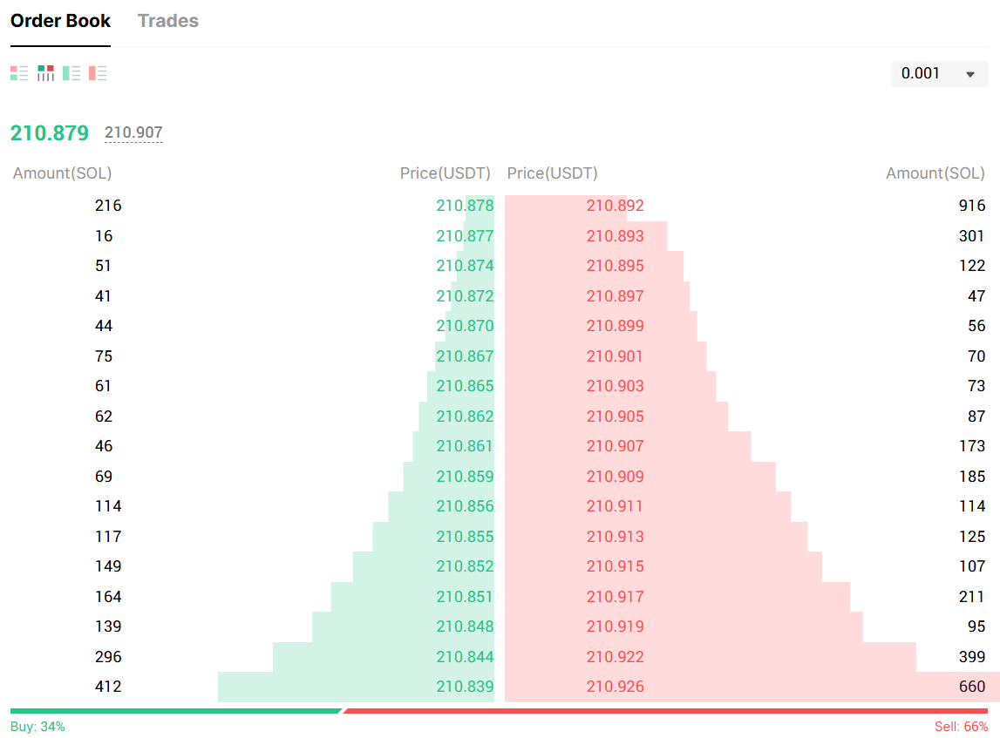

## Was bewegt den Markt?

Wenn du einen Chart betrachtest, siehst du Kurse steigen und fallen. Du siehst grüne und rote Kerzen. Vielleicht auch Volumenbalken. Aber was bewegt den Preis wirklich?
Viele glauben: „Wenn mehr Leute kaufen, steigt der Kurs.“ Das klingt logisch – ist aber nur die halbe Wahrheit.
Tatsächlich bewegt sich der Preis nur dann, wenn es ein Ungleichgewicht zwischen aktiven und passiven Marktteilnehmern gibt. Um das zu verstehen, müssen wir einen Schritt tiefer gehen – ins Herzstück der Preisbildung: den Unterschied zwischen _Market Orders_ und _Limit Orders_.

### Aktive vs. Passive Orders
Eine _Market Order_ ist aktiv. Sie sagt: „Ich will sofort kaufen oder verkaufen – egal zu welchem Preis.“
Eine _Limit Order_ dagegen ist passiv. Sie sagt: „Ich will kaufen oder verkaufen – aber nur, wenn der Preis zu mir kommt.“

> Stell dir das wie einen Flohmarkt vor. Ein Käufer mit einer Market Order geht zu einem Stand und sagt: „Ich nehm’s! Was auch immer es kostet. “Ein Käufer mit einer Limit Order bleibt ruhig sitzen und sagt: „Ich zahle genau 10 Euro. Wer mir das bringt, kriegt den Deal.“

### Wie entsteht Bewegung?
Solange sich Käufer und Verkäufer mit ihren Limit Orders in Balance befinden, passiert – nichts.
Erst wenn eine Seite bereit ist, aggressiv über das aktuelle Preisniveau hinaus zu kaufen oder zu verkaufen, entsteht Bewegung. Dieses Prinzip zeigt sich deutlich im Orderbuch eines typischen Marktes (siehe [@fig:orderbook]). Es verdeutlicht, wie sich auf der linken Seite die Limit-Kauforders („Bids“) und auf der rechten Seite die Limit-Verkaufsorders („Asks“) aufbauen. Der Preis selbst steht genau in der Mitte – und bewegt sich nur dann, wenn eine Market Order eine der Seiten aktiv durchdringt. Je größer die Fläche, desto mehr passive Orders – und desto mehr „Kraft“ braucht es, um durchzubrechen. Besonders auffällig in der Grafik sind die Stufen oder Plateaus: Sie zeigen sogenannte Buy- oder Sell Walls – also Bereiche, in denen besonders viele Limit Orders liegen. Diese wirken im Chart wie unsichtbare Barrieren, gegen die der Preis „anläuft“.
Nur wenn genug aktive Orders auf eine Seite treffen, kann der Preis diese Mauer durchbrechen.

{#fig:orderbook}

#### Was heißt das für den Chart?
Der Preis steigt, wenn Market Buy Orders in die wartenden Sell Limits schlagen – und sie dabei überbieten. Der Preis fällt, wenn Market Sell Orders durch die Buy Limits darunter durchbrechen.
Das bedeutet:

- Limit Orders halten Preiszonen
- Market Orders treiben ihn durch Zonen hindurch

Das erklärt auch, warum Preis manchmal minutenlang seitwärts läuft – und dann plötzlich explosiv reagiert: In der Seitwärtsphase dominiert Balance. In der impulsiven Phase trifft aggressive _Orderflow_ auf geringe Gegenwehr.

**Orderflow** bezeichnet die tatsächliche Abfolge von Kauf- und Verkaufsaufträgen, die gerade aktiv auf das Orderbuch treffen – also der „Druck“, der den Markt in Bewegung setzt. Wenn auf der Käuferseite viele Market Orders in kurzer Zeit auf limitierte Verkaufsangebote treffen, spricht man von bullischem Orderflow. Umgekehrt erzeugen aggressive Verkäufe bearischen Orderflow.

### Imbalance – das echte Startsignal

Wenn Market Orders eine Seite des Orderbuchs aggressiv durchbrechen, entsteht _Imbalance_ – also ein sichtbares Ungleichgewicht zwischen Angebot und Nachfrage.  
Diese Imbalance ist nicht nur ein Moment der Bewegung, sondern ein Signal für potenzielle Folgeaktivität:  

- Käufer sind bereit, immer höhere Preise zu akzeptieren: _bullische Imbalance_
- Verkäufer drücken durch die Bids: _bärische Imbalance_

Imbalance ist das, was in vielen Konzepten als "Momentum", "Breakout" oder "FVG" bezeichnet wird (siehe [@fig:imbalance]) – nur dass hier die Marktdynamik selbst spricht, nicht ein Pattern.  Sie zeigt: Der Markt ist aus dem Gleichgewicht geraten und _etwas will hier durch._

Als Trader kannst du Imbalance nutzen, um:

- Zonen zu identifizieren, in denen der Markt effizient oder ineffizient gehandelt hat
- zu erkennen, ob ein Bewegungsbeginn echte Kraft hat – oder nur ein kurzes Zucken ist
- Rückläufer in ehemalige Imbalance-Bereiche als mögliche Re-Entry-Zonen zu nutzen

{#fig:imbalance}

::: {.remark}
  Eine Imbalance ist nicht „einfach nur ein Move“ – sie ist der _Fußabdruck aktiver Überzeugung_ im Orderbuch.
:::

### Relevanz für dein Trading
Du kannst den schönsten Chart der Welt analysieren – aber wenn du nicht erkennst, wo echte Bewegung möglich ist, bleibst du immer einen Schritt zu spät.
Wenn du hingegen weißt, wo Limit Orders den Preis wahrscheinlich stoppen und wo Market Orders den Weg freimachen, wird dein Verständnis von Struktur, Zonen und Entry deutlich klarer.

Diese Dynamik – wer den Preis wirklich bewegt und wer ihn aufhält – ist der rote Faden durch alles, was später kommt. Egal ob es um Unterstützungszonen, starke Bewegungen oder Einstiegssignale geht: Wer versteht, wie Preis auf Orderfluss reagiert, sieht den Markt mit anderen Augen.

::: {.remark}
  Preis ist keine Linie. Preis ist Verhalten. Und Verhalten entsteht durch Druck – oder durch Abwesenheit von Widerstand.
:::

::: {.takeaway}
**Takeaways:**

- Der Preis wird nicht durch „mehr Käufer“ bewegt, sondern durch Market Orders, die bereit sind, das Orderbuch zu durchbrechen
- Limit Orders stoppen, Market Orders bewegen
- Balance = Seitwärtsbewegung → Imbalance = impulsive Bewegung
- Deine Aufgabe ist es, zu erkennen:  Wo stehen passive Orders? Wo kann ein Durchbruch passieren?
:::